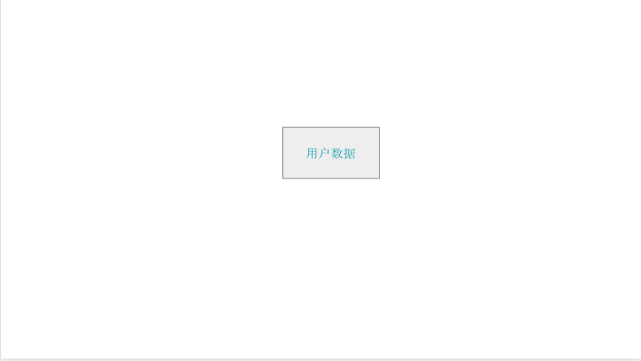
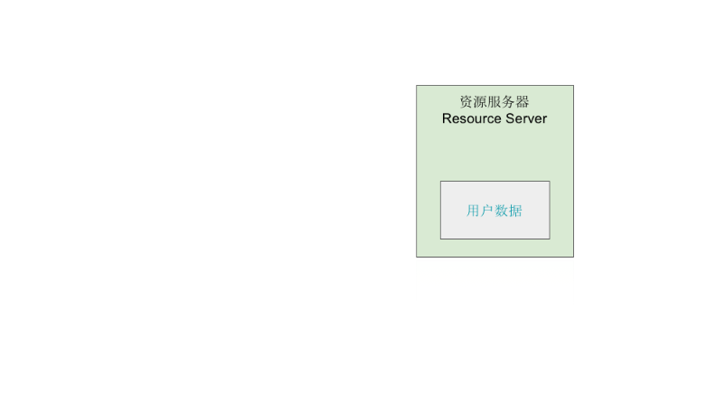
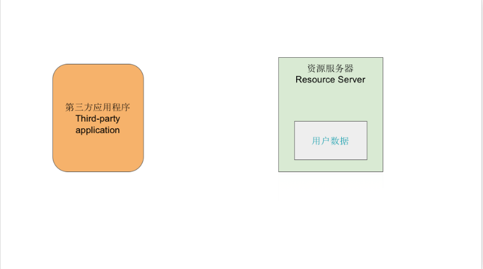
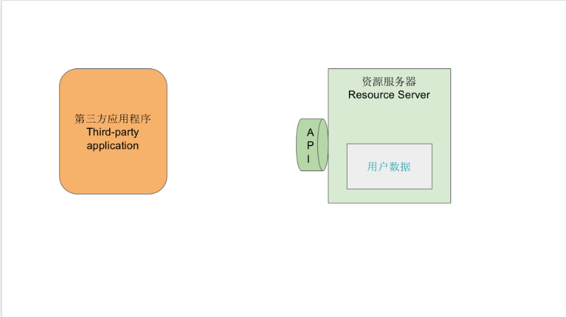
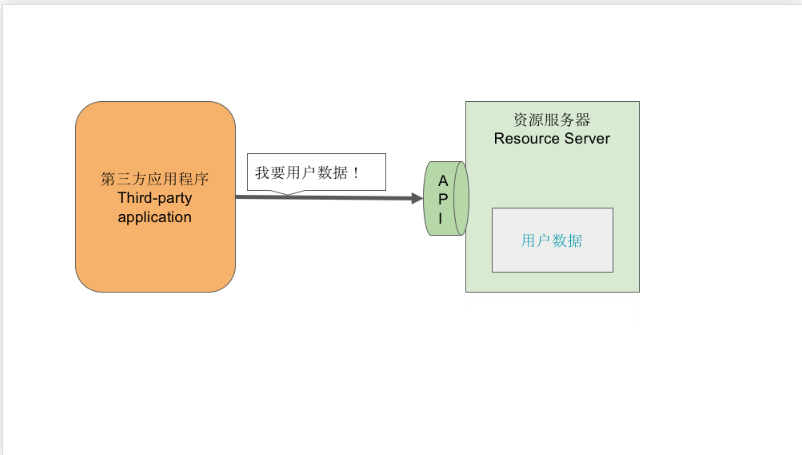
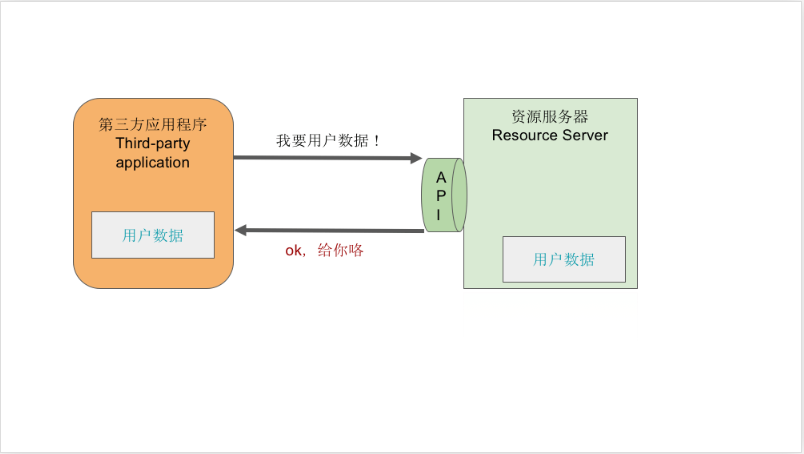
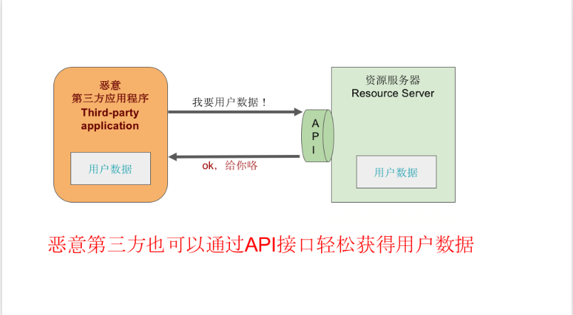

# OAuth2.0

## 图解

* **我们这里有一份用户的数据**

* **用户的数据我们保存在资源服务器 (Resource server) 里**

* **有个 第三方应用程序（Third-party application）想要请求资源服务器要用户数据**

* **为了让用户数据和第三方程序程序良好的交互，资源服务器准备了一个 API 接口**

* **第三方应用程序向资源服务器请求用户的数据**
 

* **资源服务器表示好的给你了**
  

* **但如果这个第三方应用程序是恶意的第三方呢？那么就会有以下的场景出现**

