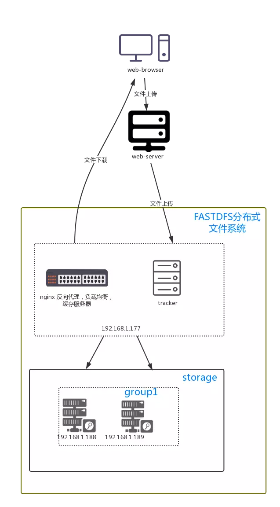

- [安装扩展](#%E5%AE%89%E8%A3%85%E6%89%A9%E5%B1%95)
- [FastDfs 结构](#FastDfs-%E7%BB%93%E6%9E%84)
    - [介绍](#%E4%BB%8B%E7%BB%8D)
    - [tracker-server](#tracker-server)
    - [storage-server](#storage-server)
    - [group](#group)
    - [meta data](#meta-data)
    - [部署结构](#%E9%83%A8%E7%BD%B2%E7%BB%93%E6%9E%84)
- [FastDFS 函数](#FastDFS-%E5%87%BD%E6%95%B0)
    - [返回版本](#%E8%BF%94%E5%9B%9E%E7%89%88%E6%9C%AC)
    - [返回最新的错误代码](#%E8%BF%94%E5%9B%9E%E6%9C%80%E6%96%B0%E7%9A%84%E9%94%99%E8%AF%AF%E4%BB%A3%E7%A0%81)
    - [返回最新的错误信息](#%E8%BF%94%E5%9B%9E%E6%9C%80%E6%96%B0%E7%9A%84%E9%94%99%E8%AF%AF%E4%BF%A1%E6%81%AF)
    - [生成token 供HTTP下载](#%E7%94%9F%E6%88%90token-%E4%BE%9BHTTP%E4%B8%8B%E8%BD%BD)
    - [从文件名获取文件信息](#%E4%BB%8E%E6%96%87%E4%BB%B6%E5%90%8D%E8%8E%B7%E5%8F%96%E6%96%87%E4%BB%B6%E4%BF%A1%E6%81%AF)
    - [从文件id获取文件信息](#%E4%BB%8E%E6%96%87%E4%BB%B6id%E8%8E%B7%E5%8F%96%E6%96%87%E4%BB%B6%E4%BF%A1%E6%81%AF)
    - [发送数据](#%E5%8F%91%E9%80%81%E6%95%B0%E6%8D%AE)
    - [生成从服务器文件名](#%E7%94%9F%E6%88%90%E4%BB%8E%E6%9C%8D%E5%8A%A1%E5%99%A8%E6%96%87%E4%BB%B6%E5%90%8D)
    - [检查文件是否存在](#%E6%A3%80%E6%9F%A5%E6%96%87%E4%BB%B6%E6%98%AF%E5%90%A6%E5%AD%98%E5%9C%A8)
    - [检查文件是否存在1](#%E6%A3%80%E6%9F%A5%E6%96%87%E4%BB%B6%E6%98%AF%E5%90%A6%E5%AD%98%E5%9C%A81)
    - [上传文件到服务器 返回数组](#%E4%B8%8A%E4%BC%A0%E6%96%87%E4%BB%B6%E5%88%B0%E6%9C%8D%E5%8A%A1%E5%99%A8-%E8%BF%94%E5%9B%9E%E6%95%B0%E7%BB%84)
    - [上传文件到服务器 返回bool](#%E4%B8%8A%E4%BC%A0%E6%96%87%E4%BB%B6%E5%88%B0%E6%9C%8D%E5%8A%A1%E5%99%A8-%E8%BF%94%E5%9B%9Ebool)
    - [上传文件缓存到服务器 返回文件信息](#%E4%B8%8A%E4%BC%A0%E6%96%87%E4%BB%B6%E7%BC%93%E5%AD%98%E5%88%B0%E6%9C%8D%E5%8A%A1%E5%99%A8-%E8%BF%94%E5%9B%9E%E6%96%87%E4%BB%B6%E4%BF%A1%E6%81%AF)
    - [上传文件缓存到服务器 返回bool](#%E4%B8%8A%E4%BC%A0%E6%96%87%E4%BB%B6%E7%BC%93%E5%AD%98%E5%88%B0%E6%9C%8D%E5%8A%A1%E5%99%A8-%E8%BF%94%E5%9B%9Ebool)
    - [通过回调函数上传文件到服务器](#%E9%80%9A%E8%BF%87%E5%9B%9E%E8%B0%83%E5%87%BD%E6%95%B0%E4%B8%8A%E4%BC%A0%E6%96%87%E4%BB%B6%E5%88%B0%E6%9C%8D%E5%8A%A1%E5%99%A8)
    - [通过回调函数上传文件到服务器 bool](#%E9%80%9A%E8%BF%87%E5%9B%9E%E8%B0%83%E5%87%BD%E6%95%B0%E4%B8%8A%E4%BC%A0%E6%96%87%E4%BB%B6%E5%88%B0%E6%9C%8D%E5%8A%A1%E5%99%A8-bool)
    - [上传文件到服务器作为追加文件](#%E4%B8%8A%E4%BC%A0%E6%96%87%E4%BB%B6%E5%88%B0%E6%9C%8D%E5%8A%A1%E5%99%A8%E4%BD%9C%E4%B8%BA%E8%BF%BD%E5%8A%A0%E6%96%87%E4%BB%B6)
    - [上传文件到服务器作为追加文件 bool](#%E4%B8%8A%E4%BC%A0%E6%96%87%E4%BB%B6%E5%88%B0%E6%9C%8D%E5%8A%A1%E5%99%A8%E4%BD%9C%E4%B8%BA%E8%BF%BD%E5%8A%A0%E6%96%87%E4%BB%B6-bool)
    - [上传文件 buff 到服务器 作为追加文件](#%E4%B8%8A%E4%BC%A0%E6%96%87%E4%BB%B6-buff-%E5%88%B0%E6%9C%8D%E5%8A%A1%E5%99%A8-%E4%BD%9C%E4%B8%BA%E8%BF%BD%E5%8A%A0%E6%96%87%E4%BB%B6)
    - [上传文件 buff 到服务器 作为追加文件 bool](#%E4%B8%8A%E4%BC%A0%E6%96%87%E4%BB%B6-buff-%E5%88%B0%E6%9C%8D%E5%8A%A1%E5%99%A8-%E4%BD%9C%E4%B8%BA%E8%BF%BD%E5%8A%A0%E6%96%87%E4%BB%B6-bool)
    - [用回调函数上传文件 buff 到服务器 作为追加文件](#%E7%94%A8%E5%9B%9E%E8%B0%83%E5%87%BD%E6%95%B0%E4%B8%8A%E4%BC%A0%E6%96%87%E4%BB%B6-buff-%E5%88%B0%E6%9C%8D%E5%8A%A1%E5%99%A8-%E4%BD%9C%E4%B8%BA%E8%BF%BD%E5%8A%A0%E6%96%87%E4%BB%B6)
    - [用回调函数上传文件 buff 到服务器 作为追加文件 bool](#%E7%94%A8%E5%9B%9E%E8%B0%83%E5%87%BD%E6%95%B0%E4%B8%8A%E4%BC%A0%E6%96%87%E4%BB%B6-buff-%E5%88%B0%E6%9C%8D%E5%8A%A1%E5%99%A8-%E4%BD%9C%E4%B8%BA%E8%BF%BD%E5%8A%A0%E6%96%87%E4%BB%B6-bool)
    - [追加本地文件到服务器的追加文件](#%E8%BF%BD%E5%8A%A0%E6%9C%AC%E5%9C%B0%E6%96%87%E4%BB%B6%E5%88%B0%E6%9C%8D%E5%8A%A1%E5%99%A8%E7%9A%84%E8%BF%BD%E5%8A%A0%E6%96%87%E4%BB%B6)
    - [追加本地文件到服务器的追加文件 bool](#%E8%BF%BD%E5%8A%A0%E6%9C%AC%E5%9C%B0%E6%96%87%E4%BB%B6%E5%88%B0%E6%9C%8D%E5%8A%A1%E5%99%A8%E7%9A%84%E8%BF%BD%E5%8A%A0%E6%96%87%E4%BB%B6-bool)
    - [追加buff到服务器 追加文件](#%E8%BF%BD%E5%8A%A0buff%E5%88%B0%E6%9C%8D%E5%8A%A1%E5%99%A8-%E8%BF%BD%E5%8A%A0%E6%96%87%E4%BB%B6)
    - [追加buff到服务器 追加文件 bool](#%E8%BF%BD%E5%8A%A0buff%E5%88%B0%E6%9C%8D%E5%8A%A1%E5%99%A8-%E8%BF%BD%E5%8A%A0%E6%96%87%E4%BB%B6-bool)
    - [通过回调函数追加文件到服务器 追加文件](#%E9%80%9A%E8%BF%87%E5%9B%9E%E8%B0%83%E5%87%BD%E6%95%B0%E8%BF%BD%E5%8A%A0%E6%96%87%E4%BB%B6%E5%88%B0%E6%9C%8D%E5%8A%A1%E5%99%A8-%E8%BF%BD%E5%8A%A0%E6%96%87%E4%BB%B6)
    - [通过回调函数追加文件到服务器 追加文件 bool](#%E9%80%9A%E8%BF%87%E5%9B%9E%E8%B0%83%E5%87%BD%E6%95%B0%E8%BF%BD%E5%8A%A0%E6%96%87%E4%BB%B6%E5%88%B0%E6%9C%8D%E5%8A%A1%E5%99%A8-%E8%BF%BD%E5%8A%A0%E6%96%87%E4%BB%B6-bool)
    - [用本地文件修改追加文件](#%E7%94%A8%E6%9C%AC%E5%9C%B0%E6%96%87%E4%BB%B6%E4%BF%AE%E6%94%B9%E8%BF%BD%E5%8A%A0%E6%96%87%E4%BB%B6)
    - [用本地文件修改追加文件1](#%E7%94%A8%E6%9C%AC%E5%9C%B0%E6%96%87%E4%BB%B6%E4%BF%AE%E6%94%B9%E8%BF%BD%E5%8A%A0%E6%96%87%E4%BB%B61)
    - [修改追加文件 通过buff](#%E4%BF%AE%E6%94%B9%E8%BF%BD%E5%8A%A0%E6%96%87%E4%BB%B6-%E9%80%9A%E8%BF%87buff)
    - [修改追加文件 通过buff1](#%E4%BF%AE%E6%94%B9%E8%BF%BD%E5%8A%A0%E6%96%87%E4%BB%B6-%E9%80%9A%E8%BF%87buff1)
    - [修改追加文件通过回调](#%E4%BF%AE%E6%94%B9%E8%BF%BD%E5%8A%A0%E6%96%87%E4%BB%B6%E9%80%9A%E8%BF%87%E5%9B%9E%E8%B0%83)
    - [修改追加文件通过回调1](#%E4%BF%AE%E6%94%B9%E8%BF%BD%E5%8A%A0%E6%96%87%E4%BB%B6%E9%80%9A%E8%BF%87%E5%9B%9E%E8%B0%831)
    - [剪切追加文件到为某一size](#%E5%89%AA%E5%88%87%E8%BF%BD%E5%8A%A0%E6%96%87%E4%BB%B6%E5%88%B0%E4%B8%BA%E6%9F%90%E4%B8%80size)
    - [剪切追加文件到为某一size1](#%E5%89%AA%E5%88%87%E8%BF%BD%E5%8A%A0%E6%96%87%E4%BB%B6%E5%88%B0%E4%B8%BA%E6%9F%90%E4%B8%80size1)
    - [上传本地文件到服务器slave file mode](#%E4%B8%8A%E4%BC%A0%E6%9C%AC%E5%9C%B0%E6%96%87%E4%BB%B6%E5%88%B0%E6%9C%8D%E5%8A%A1%E5%99%A8slave-file-mode)
    - [上传本地文件到服务器slave file mode bool](#%E4%B8%8A%E4%BC%A0%E6%9C%AC%E5%9C%B0%E6%96%87%E4%BB%B6%E5%88%B0%E6%9C%8D%E5%8A%A1%E5%99%A8slave-file-mode-bool)
    - [上传文件缓存到 服务器 slave file mode](#%E4%B8%8A%E4%BC%A0%E6%96%87%E4%BB%B6%E7%BC%93%E5%AD%98%E5%88%B0-%E6%9C%8D%E5%8A%A1%E5%99%A8-slave-file-mode)
    - [上传文件缓存到 服务器 slave file mode bool](#%E4%B8%8A%E4%BC%A0%E6%96%87%E4%BB%B6%E7%BC%93%E5%AD%98%E5%88%B0-%E6%9C%8D%E5%8A%A1%E5%99%A8-slave-file-mode-bool)
    - [用回调上传文件 slave file mode](#%E7%94%A8%E5%9B%9E%E8%B0%83%E4%B8%8A%E4%BC%A0%E6%96%87%E4%BB%B6-slave-file-mode)
    - [用回调上传文件 slave file mode bool](#%E7%94%A8%E5%9B%9E%E8%B0%83%E4%B8%8A%E4%BC%A0%E6%96%87%E4%BB%B6-slave-file-mode-bool)
    - [删除文件](#%E5%88%A0%E9%99%A4%E6%96%87%E4%BB%B6)
    - [删除文件1](#%E5%88%A0%E9%99%A4%E6%96%87%E4%BB%B61)
    - [从服务器获取文件内容](#%E4%BB%8E%E6%9C%8D%E5%8A%A1%E5%99%A8%E8%8E%B7%E5%8F%96%E6%96%87%E4%BB%B6%E5%86%85%E5%AE%B9)
    - [从服务器获取文件内容1](#%E4%BB%8E%E6%9C%8D%E5%8A%A1%E5%99%A8%E8%8E%B7%E5%8F%96%E6%96%87%E4%BB%B6%E5%86%85%E5%AE%B91)
    - [下载文件到本地](#%E4%B8%8B%E8%BD%BD%E6%96%87%E4%BB%B6%E5%88%B0%E6%9C%AC%E5%9C%B0)
    - [下载文件到本地1](#%E4%B8%8B%E8%BD%BD%E6%96%87%E4%BB%B6%E5%88%B0%E6%9C%AC%E5%9C%B01)
    - [通过回调下载文件到本地](#%E9%80%9A%E8%BF%87%E5%9B%9E%E8%B0%83%E4%B8%8B%E8%BD%BD%E6%96%87%E4%BB%B6%E5%88%B0%E6%9C%AC%E5%9C%B0)
    - [通过回调下载文件到本地](#%E9%80%9A%E8%BF%87%E5%9B%9E%E8%B0%83%E4%B8%8B%E8%BD%BD%E6%96%87%E4%BB%B6%E5%88%B0%E6%9C%AC%E5%9C%B0-1)
    - [设置文件头](#%E8%AE%BE%E7%BD%AE%E6%96%87%E4%BB%B6%E5%A4%B4)
    - [设置文件头1](#%E8%AE%BE%E7%BD%AE%E6%96%87%E4%BB%B6%E5%A4%B41)
    - [获取文件头](#%E8%8E%B7%E5%8F%96%E6%96%87%E4%BB%B6%E5%A4%B4)
    - [获取文件头1](#%E8%8E%B7%E5%8F%96%E6%96%87%E4%BB%B6%E5%A4%B41)
    - [链接服务器](#%E9%93%BE%E6%8E%A5%E6%9C%8D%E5%8A%A1%E5%99%A8)
    - [断开服务器](#%E6%96%AD%E5%BC%80%E6%9C%8D%E5%8A%A1%E5%99%A8)
    - [发送测试到服务器](#%E5%8F%91%E9%80%81%E6%B5%8B%E8%AF%95%E5%88%B0%E6%9C%8D%E5%8A%A1%E5%99%A8)
    - [获取connected tracker server](#%E8%8E%B7%E5%8F%96connected-tracker-server)
    - [连接到所有 tracker servers](#%E8%BF%9E%E6%8E%A5%E5%88%B0%E6%89%80%E6%9C%89-tracker-servers)
    - [断开所有 tracker servers](#%E6%96%AD%E5%BC%80%E6%89%80%E6%9C%89-tracker-servers)
    - [获取group 信息](#%E8%8E%B7%E5%8F%96group-%E4%BF%A1%E6%81%AF)
    - [获取storage server info](#%E8%8E%B7%E5%8F%96storage-server-info)
    - [获取 storage server list](#%E8%8E%B7%E5%8F%96-storage-server-list)
    - [获取storage server info 去设置meta](#%E8%8E%B7%E5%8F%96storage-server-info-%E5%8E%BB%E8%AE%BE%E7%BD%AEmeta)
    - [获取storage server info 去设置meta1](#%E8%8E%B7%E5%8F%96storage-server-info-%E5%8E%BB%E8%AE%BE%E7%BD%AEmeta1)
    - [获取 the storage server info去下载文件](#%E8%8E%B7%E5%8F%96-the-storage-server-info%E5%8E%BB%E4%B8%8B%E8%BD%BD%E6%96%87%E4%BB%B6)
    - [获取 the storage server info去下载文件1](#%E8%8E%B7%E5%8F%96-the-storage-server-info%E5%8E%BB%E4%B8%8B%E8%BD%BD%E6%96%87%E4%BB%B61)
    - [the storage server list](#the-storage-server-list)
    - [获取可以retrieve the file content or metadata 的服务器列表](#%E8%8E%B7%E5%8F%96%E5%8F%AF%E4%BB%A5retrieve-the-file-content-or-metadata-%E7%9A%84%E6%9C%8D%E5%8A%A1%E5%99%A8%E5%88%97%E8%A1%A8)
    - [删除存储服务器](#%E5%88%A0%E9%99%A4%E5%AD%98%E5%82%A8%E6%9C%8D%E5%8A%A1%E5%99%A8)
- [FastDFS 类](#FastDFS-%E7%B1%BB)
    - [构造器](#%E6%9E%84%E9%80%A0%E5%99%A8)
    - [获取最新的错误号](#%E8%8E%B7%E5%8F%96%E6%9C%80%E6%96%B0%E7%9A%84%E9%94%99%E8%AF%AF%E5%8F%B7)
    - [获取最新的错误信息](#%E8%8E%B7%E5%8F%96%E6%9C%80%E6%96%B0%E7%9A%84%E9%94%99%E8%AF%AF%E4%BF%A1%E6%81%AF)
    - [发送数据](#%E5%8F%91%E9%80%81%E6%95%B0%E6%8D%AE-1)
    - [生成HTTP下载TOKEN](#%E7%94%9F%E6%88%90HTTP%E4%B8%8B%E8%BD%BDTOKEN)
    - [获取文件信息](#%E8%8E%B7%E5%8F%96%E6%96%87%E4%BB%B6%E4%BF%A1%E6%81%AF)
    - [获取文件信息1](#%E8%8E%B7%E5%8F%96%E6%96%87%E4%BB%B6%E4%BF%A1%E6%81%AF1)
    - [通过主文件名生成从文件名](#%E9%80%9A%E8%BF%87%E4%B8%BB%E6%96%87%E4%BB%B6%E5%90%8D%E7%94%9F%E6%88%90%E4%BB%8E%E6%96%87%E4%BB%B6%E5%90%8D)
    - [判断文件是否存在](#%E5%88%A4%E6%96%AD%E6%96%87%E4%BB%B6%E6%98%AF%E5%90%A6%E5%AD%98%E5%9C%A8)
    - [判断文件是否存在 bool](#%E5%88%A4%E6%96%AD%E6%96%87%E4%BB%B6%E6%98%AF%E5%90%A6%E5%AD%98%E5%9C%A8-bool)
    - [上传本地文件到服务器](#%E4%B8%8A%E4%BC%A0%E6%9C%AC%E5%9C%B0%E6%96%87%E4%BB%B6%E5%88%B0%E6%9C%8D%E5%8A%A1%E5%99%A8)
    - [上传本地文件到服务器 bool](#%E4%B8%8A%E4%BC%A0%E6%9C%AC%E5%9C%B0%E6%96%87%E4%BB%B6%E5%88%B0%E6%9C%8D%E5%8A%A1%E5%99%A8-bool)
    - [上传文件buff到服务器](#%E4%B8%8A%E4%BC%A0%E6%96%87%E4%BB%B6buff%E5%88%B0%E6%9C%8D%E5%8A%A1%E5%99%A8)
    - [用回调函数上传文件](#%E7%94%A8%E5%9B%9E%E8%B0%83%E5%87%BD%E6%95%B0%E4%B8%8A%E4%BC%A0%E6%96%87%E4%BB%B6)
    - [用回调函数上传文件 bool](#%E7%94%A8%E5%9B%9E%E8%B0%83%E5%87%BD%E6%95%B0%E4%B8%8A%E4%BC%A0%E6%96%87%E4%BB%B6-bool)
    - [上传本地文件到服务器作为 附加文件](#%E4%B8%8A%E4%BC%A0%E6%9C%AC%E5%9C%B0%E6%96%87%E4%BB%B6%E5%88%B0%E6%9C%8D%E5%8A%A1%E5%99%A8%E4%BD%9C%E4%B8%BA-%E9%99%84%E5%8A%A0%E6%96%87%E4%BB%B6)
    - [上传本地文件到服务器作为 附加文件 bool](#%E4%B8%8A%E4%BC%A0%E6%9C%AC%E5%9C%B0%E6%96%87%E4%BB%B6%E5%88%B0%E6%9C%8D%E5%8A%A1%E5%99%A8%E4%BD%9C%E4%B8%BA-%E9%99%84%E5%8A%A0%E6%96%87%E4%BB%B6-bool)
    - [上传buff作为附加文件](#%E4%B8%8A%E4%BC%A0buff%E4%BD%9C%E4%B8%BA%E9%99%84%E5%8A%A0%E6%96%87%E4%BB%B6)
    - [上传buff作为附加文件 bool](#%E4%B8%8A%E4%BC%A0buff%E4%BD%9C%E4%B8%BA%E9%99%84%E5%8A%A0%E6%96%87%E4%BB%B6-bool)
    - [用回调上传附加文件](#%E7%94%A8%E5%9B%9E%E8%B0%83%E4%B8%8A%E4%BC%A0%E9%99%84%E5%8A%A0%E6%96%87%E4%BB%B6)
    - [用回调上传附加文件 bool](#%E7%94%A8%E5%9B%9E%E8%B0%83%E4%B8%8A%E4%BC%A0%E9%99%84%E5%8A%A0%E6%96%87%E4%BB%B6-bool)
    - [追加本地文件到附件](#%E8%BF%BD%E5%8A%A0%E6%9C%AC%E5%9C%B0%E6%96%87%E4%BB%B6%E5%88%B0%E9%99%84%E4%BB%B6)
    - [追加本地文件到附件 bool](#%E8%BF%BD%E5%8A%A0%E6%9C%AC%E5%9C%B0%E6%96%87%E4%BB%B6%E5%88%B0%E9%99%84%E4%BB%B6-bool)
    - [追加buff到附加文件](#%E8%BF%BD%E5%8A%A0buff%E5%88%B0%E9%99%84%E5%8A%A0%E6%96%87%E4%BB%B6)
    - [追加buff到附加文件1](#%E8%BF%BD%E5%8A%A0buff%E5%88%B0%E9%99%84%E5%8A%A0%E6%96%87%E4%BB%B61)
    - [用回调追加buff到附加文件](#%E7%94%A8%E5%9B%9E%E8%B0%83%E8%BF%BD%E5%8A%A0buff%E5%88%B0%E9%99%84%E5%8A%A0%E6%96%87%E4%BB%B6)
    - [用回调追加buff到附加文件 bool](#%E7%94%A8%E5%9B%9E%E8%B0%83%E8%BF%BD%E5%8A%A0buff%E5%88%B0%E9%99%84%E5%8A%A0%E6%96%87%E4%BB%B6-bool)
    - [用本地文件修改 附件](#%E7%94%A8%E6%9C%AC%E5%9C%B0%E6%96%87%E4%BB%B6%E4%BF%AE%E6%94%B9-%E9%99%84%E4%BB%B6)
    - [用本地文件修改 附件 bool](#%E7%94%A8%E6%9C%AC%E5%9C%B0%E6%96%87%E4%BB%B6%E4%BF%AE%E6%94%B9-%E9%99%84%E4%BB%B6-bool)
    - [用 buff修改附件](#%E7%94%A8-buff%E4%BF%AE%E6%94%B9%E9%99%84%E4%BB%B6)
    - [用 buff修改附件 bool](#%E7%94%A8-buff%E4%BF%AE%E6%94%B9%E9%99%84%E4%BB%B6-bool)
    - [用回调修改附件](#%E7%94%A8%E5%9B%9E%E8%B0%83%E4%BF%AE%E6%94%B9%E9%99%84%E4%BB%B6)
    - [用回调修改附件 bool](#%E7%94%A8%E5%9B%9E%E8%B0%83%E4%BF%AE%E6%94%B9%E9%99%84%E4%BB%B6-bool)
    - [切割附件](#%E5%88%87%E5%89%B2%E9%99%84%E4%BB%B6)
    - [切割附件1](#%E5%88%87%E5%89%B2%E9%99%84%E4%BB%B61)
    - [上传本地文件到服务器 slave file mode](#%E4%B8%8A%E4%BC%A0%E6%9C%AC%E5%9C%B0%E6%96%87%E4%BB%B6%E5%88%B0%E6%9C%8D%E5%8A%A1%E5%99%A8-slave-file-mode)
    - [上传本地文件到服务器 slave file mode 1](#%E4%B8%8A%E4%BC%A0%E6%9C%AC%E5%9C%B0%E6%96%87%E4%BB%B6%E5%88%B0%E6%9C%8D%E5%8A%A1%E5%99%A8-slave-file-mode-1)
    - [上传buff到服务器 slave file mode](#%E4%B8%8A%E4%BC%A0buff%E5%88%B0%E6%9C%8D%E5%8A%A1%E5%99%A8-slave-file-mode)
    - [用回调上传文件 slave file mode](#%E7%94%A8%E5%9B%9E%E8%B0%83%E4%B8%8A%E4%BC%A0%E6%96%87%E4%BB%B6-slave-file-mode-1)
    - [用回调上传文件 slave file mode 1](#%E7%94%A8%E5%9B%9E%E8%B0%83%E4%B8%8A%E4%BC%A0%E6%96%87%E4%BB%B6-slave-file-mode-1)
    - [删除存储服务器](#%E5%88%A0%E9%99%A4%E5%AD%98%E5%82%A8%E6%9C%8D%E5%8A%A1%E5%99%A8-1)
    - [删除服务器文件](#%E5%88%A0%E9%99%A4%E6%9C%8D%E5%8A%A1%E5%99%A8%E6%96%87%E4%BB%B6)
    - [获取文件内容](#%E8%8E%B7%E5%8F%96%E6%96%87%E4%BB%B6%E5%86%85%E5%AE%B9)
    - [获取文件内容 1](#%E8%8E%B7%E5%8F%96%E6%96%87%E4%BB%B6%E5%86%85%E5%AE%B9-1)
    - [下载服务器文件](#%E4%B8%8B%E8%BD%BD%E6%9C%8D%E5%8A%A1%E5%99%A8%E6%96%87%E4%BB%B6)
    - [下载服务器文件1](#%E4%B8%8B%E8%BD%BD%E6%9C%8D%E5%8A%A1%E5%99%A8%E6%96%87%E4%BB%B61)
    - [用回调下载文件](#%E7%94%A8%E5%9B%9E%E8%B0%83%E4%B8%8B%E8%BD%BD%E6%96%87%E4%BB%B6)
    - [用回调下载文件1](#%E7%94%A8%E5%9B%9E%E8%B0%83%E4%B8%8B%E8%BD%BD%E6%96%87%E4%BB%B61)
    - [set meta data](#set-meta-data)
    - [set meta data 1](#set-meta-data-1)
    - [获取get meta data of the file](#%E8%8E%B7%E5%8F%96get-meta-data-of-the-file)
    - [获取get meta data of the file 1](#%E8%8E%B7%E5%8F%96get-meta-data-of-the-file-1)
    - [连接服务器](#%E8%BF%9E%E6%8E%A5%E6%9C%8D%E5%8A%A1%E5%99%A8)
    - [断开连接](#%E6%96%AD%E5%BC%80%E8%BF%9E%E6%8E%A5)
    - [获取一个connected tracker server](#%E8%8E%B7%E5%8F%96%E4%B8%80%E4%B8%AAconnected-tracker-server)
    - [测试服务器](#%E6%B5%8B%E8%AF%95%E6%9C%8D%E5%8A%A1%E5%99%A8)
    - [连接所有 tracker servers](#%E8%BF%9E%E6%8E%A5%E6%89%80%E6%9C%89-tracker-servers)
    - [关闭所有 tracker servers](#%E5%85%B3%E9%97%AD%E6%89%80%E6%9C%89-tracker-servers)
    - [获取组信息 group stat info](#%E8%8E%B7%E5%8F%96%E7%BB%84%E4%BF%A1%E6%81%AF-group-stat-info)
    - [get the storage server info](#get-the-storage-server-info)
    - [get the storage server list](#get-the-storage-server-list)
    - [get the storage server info to set metadata](#get-the-storage-server-info-to-set-metadata)
    - [get the storage server info to set metadata 1](#get-the-storage-server-info-to-set-metadata-1)
    - [get the storage server info to download file](#get-the-storage-server-info-to-download-file)
    - [get the storage server info to download file1](#get-the-storage-server-info-to-download-file1)
    - [获取可以检索文件内容的 storage server list](#%E8%8E%B7%E5%8F%96%E5%8F%AF%E4%BB%A5%E6%A3%80%E7%B4%A2%E6%96%87%E4%BB%B6%E5%86%85%E5%AE%B9%E7%9A%84-storage-server-list)
    - [获取可以检索文件内容的 storage server list 1](#%E8%8E%B7%E5%8F%96%E5%8F%AF%E4%BB%A5%E6%A3%80%E7%B4%A2%E6%96%87%E4%BB%B6%E5%86%85%E5%AE%B9%E7%9A%84-storage-server-list-1)
    - [从集群 delete the storage server](#%E4%BB%8E%E9%9B%86%E7%BE%A4-delete-the-storage-server)
    - [关闭连接](#%E5%85%B3%E9%97%AD%E8%BF%9E%E6%8E%A5)
# 安装扩展

- step1
```sh
phpize
./configure
make
make install
```

- step2
```sh
cp modules/fastdfs_client.so  /usr/lib/php/20060613/
```

- step3
```sh
cp fastdfs_client.ini /etc/php/
```

- step4
```sh
vi /etc/php/fastdfs_client.ini
```

- step5
```sh
#run fastdfs_test.php
php fastdfs_test.php
```

# FastDfs 结构

### 介绍
- **FastDFS是一款开源的轻量级分布式文件系统纯C实现，支持Linux、FreeBSD等UNIX系统类google FS，不是通用的文件系统，只能通过专有API访问，目前提供了C、Java和PHP API为互联网应用量身定做，解决大容量文件存储问题，追求高性能和高扩展性FastDFS可以看做是基于文件的key value pair存储系统，称作分布式文件存储服务更为合适。**

### tracker-server
- **跟踪服务器， 主要做调度工作， 起负载均衡的作用。 在内存中记录集群中所有存储组和存储服务器的状态信息， 是客户端和数据服务器交互的枢纽。 相比GFS中的master更为精简， 不记录文件索引信息， 占用的内存量很少。**

### storage-server
- **存储服务器（ 又称：存储节点或数据服务器） ， 文件和文件属性（ metadata） 都保存到存储服务器上。 Storage server直接利用OS的文件系统调用管理文件。**

### group

- **组， 也可称为卷。 同组内服务器上的文件是完全相同的 ，同一组内的storage server之间是对等的， 文件上传、 删除等操作可以在任意一台storage server上进行 。**


### meta data
- **meta data：文件相关属性，键值对（ Key Value Pair） 方式，如：width=1024,heigth=768 。**

### 部署结构



# FastDFS 函数

### 返回版本
string fastdfs_client_version()
return client library version

### 返回最新的错误代码
long fastdfs_get_last_error_no()
return last error no

### 返回最新的错误信息
string fastdfs_get_last_error_info()
return last error info

### 生成token 供HTTP下载
string fastdfs_http_gen_token(string remote_filename, int timestamp)
generate anti-steal token for HTTP download
parameters:
	remote_filename: the remote filename (do NOT including group name)
	timestamp: the timestamp (unix timestamp)
return token string for success, false for error

### 从文件名获取文件信息
array fastdfs_get_file_info(string group_name, string filename)
get file info from the filename
parameters:
	group_name: the group name of the file
	remote_filename: the filename on the storage server
return assoc array for success, false for error. 
	the assoc array including following elements:
		create_timestamp: the file create timestamp (unix timestamp)
		file_size: the file size (bytes)
		source_ip_addr: the source storage server ip address
	

### 从文件id获取文件信息
array fastdfs_get_file_info1(string file_id)
get file info from the file id
parameters:
	file_id: the file id (including group name and filename) or remote filename
return assoc array for success, false for error. 
	the assoc array including following elements:
		create_timestamp: the file create timestamp (unix timestamp)
		file_size: the file size (bytes)
		source_ip_addr: the source storage server ip address
	

### 发送数据
bool fastdfs_send_data(int sock, string buff)
parameters:
	sock: the unix socket description
	buff: the buff to send
return true for success, false for error

### 生成从服务器文件名
string fastdfs_gen_slave_filename(string master_filename, string prefix_name
                [, string file_ext_name])
generate slave filename by master filename, prefix name and file extension name
parameters:
	master_filename: the master filename / file id to generate 
			the slave filename
	prefix_name: the prefix name  to generate the slave filename
	file_ext_name: slave file extension name, can be null or emtpy 
			(do not including dot)
return slave filename string for success, false for error

### 检查文件是否存在
boolean fastdfs_storage_file_exist(string group_name, string remote_filename
	[, array tracker_server, array storage_server])
check file exist
parameters:
	group_name: the group name of the file
	remote_filename: the filename on the storage server
	tracker_server: the tracker server assoc array including elements: 
                        ip_addr, port and sock
	storage_server: the storage server assoc array including elements:
                        ip_addr, port and sock
return true for exist, false for not exist

### 检查文件是否存在1
boolean fastdfs_storage_file_exist1(string file_id
	[, array tracker_server, array storage_server])
parameters:
	file_id: the file id of the file
	tracker_server: the tracker server assoc array including elements: 
                        ip_addr, port and sock
	storage_server: the storage server assoc array including elements:
                        ip_addr, port and sock
return true for exist, false for not exist

### 上传文件到服务器 返回数组
array fastdfs_storage_upload_by_filename(string local_filename
	[, string file_ext_name, array meta_list, string group_name, 
	array tracker_server, array storage_server])
upload local file to storage server
parameters:
	local_filename: the local filename
	file_ext_name: the file extension name, do not include dot(.)
	meta_list: meta data assoc array, such as
                   array('width'=>1024, 'height'=>768)
	group_name: specify the group name to store the file
	tracker_server: the tracker server assoc array including elements: 
                        ip_addr, port and sock
	storage_server: the storage server assoc array including elements:
                        ip_addr, port and sock
return assoc array for success, false for error. 
       the returned array includes elements: group_name and filename


### 上传文件到服务器 返回bool
string fastdfs_storage_upload_by_filename1(string local_filename
	[, string file_ext_name, array meta_list, string group_name, 
	array tracker_server, array storage_server])
upload local file to storage server
parameters:
	local_filename: the local filename
	file_ext_name: the file extension name, do not include dot(.)
	meta_list: meta data assoc array, such as
                   array('width'=>1024, 'height'=>768)
	group_name: specify the group name to store the file
	tracker_server: the tracker server assoc array including elements: 
                        ip_addr, port and sock
	storage_server: the storage server assoc array including elements:
                        ip_addr, port and sock
return file_id for success, false for error.


### 上传文件缓存到服务器 返回文件信息
array fastdfs_storage_upload_by_filebuff(string file_buff
	[, string file_ext_name, array meta_list, string group_name, 
	array tracker_server, array storage_server])
upload file buff to storage server
parameters:
	file_buff: the file content
	file_ext_name: the file extension name, do not include dot(.)
	meta_list: meta data assoc array, such as
                   array('width'=>1024, 'height'=>768)
	group_name: specify the group name to store the file
	tracker_server: the tracker server assoc array including elements: 
                        ip_addr, port and sock
	storage_server: the storage server assoc array including elements:
                        ip_addr, port and sock
return assoc array for success, false for error. 
       the returned array includes elements: group_name and filename

### 上传文件缓存到服务器 返回bool
string fastdfs_storage_upload_by_filebuff1(string file_buff
	[, string file_ext_name, array meta_list, string group_name, 
	array tracker_server, array storage_server])
upload file buff to storage server
parameters:
	file_buff: the file content
	file_ext_name: the file extension name, do not include dot(.)
	meta_list: meta data assoc array, such as
                   array('width'=>1024, 'height'=>768)
	group_name: specify the group name to store the file
	tracker_server: the tracker server assoc array including elements: 
                        ip_addr, port and sock
	storage_server: the storage server assoc array including elements:
                        ip_addr, port and sock
return file_id for success, false for error


### 通过回调函数上传文件到服务器
array fastdfs_storage_upload_by_callback(array callback_array
	[, string file_ext_name, array meta_list, string group_name, 
	array tracker_server, array storage_server])
upload file to storage server by callback
parameters:
	callback_array: the callback assoc array, must have keys:
			callback  - the php callback function name
                                    callback function prototype as:
				    function upload_file_callback($sock, $args)
			file_size - the file size
			args      - use argument for callback function
	file_ext_name: the file extension name, do not include dot(.)
	meta_list: meta data assoc array, such as
                   array('width'=>1024, 'height'=>768)
	group_name: specify the group name to store the file
	tracker_server: the tracker server assoc array including elements: 
                        ip_addr, port and sock
	storage_server: the storage server assoc array including elements:
                        ip_addr, port and sock
return assoc array for success, false for error. 
       the returned array includes elements: group_name and filename

### 通过回调函数上传文件到服务器 bool
array fastdfs_storage_upload_by_callback1(array callback_array
	[, string file_ext_name, array meta_list, string group_name, 
	array tracker_server, array storage_server])
upload file to storage server by callback
parameters:
	callback_array: the callback assoc array, must have keys:
			callback  - the php callback function name
                                    callback function prototype as:
				    function upload_file_callback($sock, $args)
			file_size - the file size
			args      - use argument for callback function
	file_ext_name: the file extension name, do not include dot(.)
	meta_list: meta data assoc array, such as
                   array('width'=>1024, 'height'=>768)
	group_name: specify the group name to store the file
	tracker_server: the tracker server assoc array including elements: 
                        ip_addr, port and sock
	storage_server: the storage server assoc array including elements:
                        ip_addr, port and sock
return file_id for success, false for error


### 上传文件到服务器作为追加文件
array fastdfs_storage_upload_appender_by_filename(string local_filename
	[, string file_ext_name, array meta_list, string group_name, 
	array tracker_server, array storage_server])
upload local file to storage server as appender file
parameters:
	local_filename: the local filename
	file_ext_name: the file extension name, do not include dot(.)
	meta_list: meta data assoc array, such as
                   array('width'=>1024, 'height'=>768)
	group_name: specify the group name to store the file
	tracker_server: the tracker server assoc array including elements: 
                        ip_addr, port and sock
	storage_server: the storage server assoc array including elements:
                        ip_addr, port and sock
return assoc array for success, false for error. 
       the returned array includes elements: group_name and filename

### 上传文件到服务器作为追加文件 bool
string fastdfs_storage_upload_appender_by_filename1(string local_filename
	[, string file_ext_name, array meta_list, string group_name, 
	array tracker_server, array storage_server])
upload local file to storage server as appender file
parameters:
	local_filename: the local filename
	file_ext_name: the file extension name, do not include dot(.)
	meta_list: meta data assoc array, such as
                   array('width'=>1024, 'height'=>768)
	group_name: specify the group name to store the file
	tracker_server: the tracker server assoc array including elements: 
                        ip_addr, port and sock
	storage_server: the storage server assoc array including elements:
                        ip_addr, port and sock
return file_id for success, false for error.


### 上传文件 buff 到服务器 作为追加文件
array fastdfs_storage_upload_appender_by_filebuff(string file_buff
	[, string file_ext_name, array meta_list, string group_name, 
	array tracker_server, array storage_server])
upload file buff to storage server as appender file
parameters:
	file_buff: the file content
	file_ext_name: the file extension name, do not include dot(.)
	meta_list: meta data assoc array, such as
                   array('width'=>1024, 'height'=>768)
	group_name: specify the group name to store the file
	tracker_server: the tracker server assoc array including elements: 
                        ip_addr, port and sock
	storage_server: the storage server assoc array including elements:
                        ip_addr, port and sock
return assoc array for success, false for error. 
       the returned array includes elements: group_name and filename

### 上传文件 buff 到服务器 作为追加文件 bool
string fastdfs_storage_upload_appender_by_filebuff1(string file_buff
	[, string file_ext_name, array meta_list, string group_name, 
	array tracker_server, array storage_server])
upload file buff to storage server as appender file
parameters:
	file_buff: the file content
	file_ext_name: the file extension name, do not include dot(.)
	meta_list: meta data assoc array, such as
                   array('width'=>1024, 'height'=>768)
	group_name: specify the group name to store the file
	tracker_server: the tracker server assoc array including elements: 
                        ip_addr, port and sock
	storage_server: the storage server assoc array including elements:
                        ip_addr, port and sock
return file_id for success, false for error

### 用回调函数上传文件 buff 到服务器 作为追加文件
array fastdfs_storage_upload_appender_by_callback(array callback_array
	[, string file_ext_name, array meta_list, string group_name, 
	array tracker_server, array storage_server])
upload file to storage server by callback as appender file
parameters:
	callback_array: the callback assoc array, must have keys:
			callback  - the php callback function name
                                    callback function prototype as:
				    function upload_file_callback($sock, $args)
			file_size - the file size
			args      - use argument for callback function
	file_ext_name: the file extension name, do not include dot(.)
	meta_list: meta data assoc array, such as
                   array('width'=>1024, 'height'=>768)
	group_name: specify the group name to store the file
	tracker_server: the tracker server assoc array including elements: 
                        ip_addr, port and sock
	storage_server: the storage server assoc array including elements:
                        ip_addr, port and sock
return assoc array for success, false for error. 
       the returned array includes elements: group_name and filename

### 用回调函数上传文件 buff 到服务器 作为追加文件 bool
string fastdfs_storage_upload_appender_by_callback1(array callback_array
	[, string file_ext_name, array meta_list, string group_name, 
	array tracker_server, array storage_server])
upload file to storage server by callback as appender file
parameters:
	callback_array: the callback assoc array, must have keys:
			callback  - the php callback function name
                                    callback function prototype as:
				    function upload_file_callback($sock, $args)
			file_size - the file size
			args      - use argument for callback function
	file_ext_name: the file extension name, do not include dot(.)
	meta_list: meta data assoc array, such as
                   array('width'=>1024, 'height'=>768)
	group_name: specify the group name to store the file
	tracker_server: the tracker server assoc array including elements: 
                        ip_addr, port and sock
	storage_server: the storage server assoc array including elements:
                        ip_addr, port and sock
return file_id for success, false for error


### 追加本地文件到服务器的追加文件
boolean fastdfs_storage_append_by_filename(string local_filename, 
	string group_name, appender_filename
	[, array tracker_server, array storage_server])
append local file to the appender file of storage server
parameters:
	local_filename: the local filename
	group_name: the the group name of appender file
	appender_filename: the appender filename
	tracker_server: the tracker server assoc array including elements: 
                        ip_addr, port and sock
	storage_server: the storage server assoc array including elements:
                        ip_addr, port and sock
return true for success, false for error


### 追加本地文件到服务器的追加文件 bool
string fastdfs_storage_append_by_filename1(string local_filename, 
	string appender_file_id [, array tracker_server, array storage_server])
append local file to the appender file of storage server
parameters:
	local_filename: the local filename
	appender_file_id: the appender file id
	tracker_server: the tracker server assoc array including elements: 
                        ip_addr, port and sock
	storage_server: the storage server assoc array including elements:
                        ip_addr, port and sock
return true for success, false for error


### 追加buff到服务器 追加文件
boolean fastdfs_storage_append_by_filebuff(string file_buff, 
	string group_name, string appender_filename
	[, array tracker_server, array storage_server])
append file buff to the appender file of storage server
parameters:
	file_buff: the file content
	group_name: the the group name of appender file
	appender_filename: the appender filename
	tracker_server: the tracker server assoc array including elements: 
                        ip_addr, port and sock
	storage_server: the storage server assoc array including elements:
                        ip_addr, port and sock
return true for success, false for error


### 追加buff到服务器 追加文件 bool
boolean fastdfs_storage_append_by_filebuff1(string file_buff, 
	string appender_file_id [, array tracker_server, array storage_server])
append file buff to the appender file of storage server
parameters:
	file_buff: the file content
	appender_file_id: the appender file id
	tracker_server: the tracker server assoc array including elements: 
                        ip_addr, port and sock
	storage_server: the storage server assoc array including elements:
                        ip_addr, port and sock
return true for success, false for error


### 通过回调函数追加文件到服务器 追加文件
boolean fastdfs_storage_append_by_callback(array callback_array,
	string group_name, string appender_filename
	[, array tracker_server, array storage_server])
append file to the appender file of storage server by callback
parameters:
	callback_array: the callback assoc array, must have keys:
			callback  - the php callback function name
                                    callback function prototype as:
				    function upload_file_callback($sock, $args)
			file_size - the file size
			args      - use argument for callback function
	group_name: the the group name of appender file
	appender_filename: the appender filename
	tracker_server: the tracker server assoc array including elements: 
                        ip_addr, port and sock
	storage_server: the storage server assoc array including elements:
                        ip_addr, port and sock
return true for success, false for error


### 通过回调函数追加文件到服务器 追加文件 bool
boolean fastdfs_storage_append_by_callback1(array callback_array,
	string appender_file_id [, array tracker_server, array storage_server])
append file buff to the appender file of storage server
parameters:
	callback_array: the callback assoc array, must have keys:
			callback  - the php callback function name
                                    callback function prototype as:
				    function upload_file_callback($sock, $args)
			file_size - the file size
			args      - use argument for callback function
	appender_file_id: the appender file id
	tracker_server: the tracker server assoc array including elements: 
                        ip_addr, port and sock
	storage_server: the storage server assoc array including elements:
                        ip_addr, port and sock
return true for success, false for error


### 用本地文件修改追加文件
boolean fastdfs_storage_modify_by_filename(string local_filename, 
	long file_offset, string group_name, appender_filename, 
	[array tracker_server, array storage_server])
modify appender file by local file
parameters:
	local_filename: the local filename
        file_offset: offset of appender file
	group_name: the the group name of appender file
	appender_filename: the appender filename
	tracker_server: the tracker server assoc array including elements: 
                        ip_addr, port and sock
	storage_server: the storage server assoc array including elements:
                        ip_addr, port and sock
return true for success, false for error


### 用本地文件修改追加文件1
boolean fastdfs_storage_modify_by_filename1(string local_filename, 
	long file_offset, string appender_file_id
        [, array tracker_server, array storage_server])
modify appender file by local file
parameters:
	local_filename: the local filename
        file_offset: offset of appender file
	appender_file_id: the appender file id
	tracker_server: the tracker server assoc array including elements: 
                        ip_addr, port and sock
	storage_server: the storage server assoc array including elements:
                        ip_addr, port and sock
return true for success, false for error


### 修改追加文件 通过buff
boolean fastdfs_storage_modify_by_filebuff(string file_buff, 
	long file_offset, string group_name, string appender_filename
	[, array tracker_server, array storage_server])
modify appender file by file buff
parameters:
	file_buff: the file content
        file_offset: offset of appender file
	group_name: the the group name of appender file
	appender_filename: the appender filename
	tracker_server: the tracker server assoc array including elements: 
                        ip_addr, port and sock
	storage_server: the storage server assoc array including elements:
                        ip_addr, port and sock
return true for success, false for error


### 修改追加文件 通过buff1
boolean fastdfs_storage_modify_by_filebuff1(string file_buff, 
	long file_offset, string appender_file_id
	[, array tracker_server, array storage_server])
modify appender file by file buff
parameters:
	file_buff: the file content
        file_offset: offset of appender file
	appender_file_id: the appender file id
	tracker_server: the tracker server assoc array including elements: 
                        ip_addr, port and sock
	storage_server: the storage server assoc array including elements:
                        ip_addr, port and sock
return true for success, false for error


### 修改追加文件通过回调
boolean fastdfs_storage_modify_by_callback(array callback_array, 
	long file_offset, string group_name, string appender_filename
	[, array tracker_server, array storage_server])
modify appender file by callback
parameters:
	callback_array: the callback assoc array, must have keys:
			callback  - the php callback function name
                                    callback function prototype as:
				    function upload_file_callback($sock, $args)
			file_size - the file size
			args      - use argument for callback function
        file_offset: offset of appender file
	group_name: the the group name of appender file
	appender_filename: the appender filename
	tracker_server: the tracker server assoc array including elements: 
                        ip_addr, port and sock
	storage_server: the storage server assoc array including elements:
                        ip_addr, port and sock
return true for success, false for error


### 修改追加文件通过回调1
boolean fastdfs_storage_modify_by_callback1(array callback_array, 
	long file_offset, string group_name, string appender_filename
	[, array tracker_server, array storage_server])
modify appender file by callback
parameters:
	callback_array: the callback assoc array, must have keys:
			callback  - the php callback function name
                                    callback function prototype as:
				    function upload_file_callback($sock, $args)
			file_size - the file size
			args      - use argument for callback function
        file_offset: offset of appender file
	appender_file_id: the appender file id
	tracker_server: the tracker server assoc array including elements: 
                        ip_addr, port and sock
	storage_server: the storage server assoc array including elements:
                        ip_addr, port and sock
return true for success, false for error


### 剪切追加文件到为某一size
boolean fastdfs_storage_truncate_file(string group_name, 
	string appender_filename [, long truncated_file_size = 0, 
	array tracker_server, array storage_server])
truncate appender file to specify size
parameters:
	group_name: the the group name of appender file
	appender_filename: the appender filename
        truncated_file_size: truncate the file size to
	tracker_server: the tracker server assoc array including elements: 
                        ip_addr, port and sock
	storage_server: the storage server assoc array including elements:
                        ip_addr, port and sock
return true for success, false for error


### 剪切追加文件到为某一size1
boolean fastdfs_storage_truncate_file1(string appender_file_id
	[, long truncated_file_size = 0, array tracker_server, 
	array storage_server])
truncate appender file to specify size
parameters:
	appender_file_id: the appender file id
        truncated_file_size: truncate the file size to
	tracker_server: the tracker server assoc array including elements: 
                        ip_addr, port and sock
	storage_server: the storage server assoc array including elements:
                        ip_addr, port and sock
return true for success, false for error


### 上传本地文件到服务器slave file mode
string/array fastdfs_storage_upload_slave_by_filename(string local_filename, 
	string group_name, string master_filename, string prefix_name 
	[, string file_ext_name, array meta_list, 
	array tracker_server, array storage_server])
upload local file to storage server (slave file mode)
parameters:
	file_buff: the file content
	group_name: the group name of the master file
	master_filename: the master filename to generate the slave file id
	prefix_name: the prefix name to generage the slave file id
	file_ext_name: the file extension name, do not include dot(.)
	meta_list: meta data assoc array, such as
                   array('width'=>1024, 'height'=>768)
	tracker_server: the tracker server assoc array including elements: 
                        ip_addr, port and sock
	storage_server: the storage server assoc array including elements:
                        ip_addr, port and sock
return assoc array for success, false for error. 
       the returned array includes elements: group_name and filename


### 上传本地文件到服务器slave file mode bool
string fastdfs_storage_upload_slave_by_filename1(string local_filename, 
	string master_file_id, string prefix_name 
	[, string file_ext_name, array meta_list, 
	array tracker_server, array storage_server])
upload local file to storage server (slave file mode)
parameters:
	local_filename: the local filename
	master_file_id: the master file id to generate the slave file id
	prefix_name: the prefix name to generage the slave file id
	file_ext_name: the file extension name, do not include dot(.)
	meta_list: meta data assoc array, such as
                   array('width'=>1024, 'height'=>768)
	tracker_server: the tracker server assoc array including elements: 
                        ip_addr, port and sock
	storage_server: the storage server assoc array including elements:
                        ip_addr, port and sock
return file_id for success, false for error.

### 上传文件缓存到 服务器 slave file mode
array fastdfs_storage_upload_slave_by_filebuff(string file_buff, 
	string group_name, string master_filename, string prefix_name 
	[, string file_ext_name, array meta_list, 
	array tracker_server, array storage_server])
upload file buff to storage server (slave file mode)
parameters:
	file_buff: the file content
	group_name: the group name of the master file
	master_filename: the master filename to generate the slave file id
	prefix_name: the prefix name to generage the slave file id
	file_ext_name: the file extension name, do not include dot(.)
	meta_list: meta data assoc array, such as
                   array('width'=>1024, 'height'=>768)
	tracker_server: the tracker server assoc array including elements: 
                        ip_addr, port and sock
	storage_server: the storage server assoc array including elements:
                        ip_addr, port and sock
return assoc array for success, false for error. 
       the returned array includes elements: group_name and filename

### 上传文件缓存到 服务器 slave file mode bool
string fastdfs_storage_upload_slave_by_filebuff1(string file_buff, 
	string master_file_id, string prefix_name
	[, string file_ext_name, array meta_list, 
	array tracker_server, array storage_server])
upload file buff to storage server (slave file mode)
parameters:
	file_buff: the file content
	master_file_id: the master file id to generate the slave file id
	prefix_name: the prefix name to generage the slave file id
	file_ext_name: the file extension name, do not include dot(.)
	meta_list: meta data assoc array, such as
                   array('width'=>1024, 'height'=>768)
	tracker_server: the tracker server assoc array including elements: 
                        ip_addr, port and sock
	storage_server: the storage server assoc array including elements:
                        ip_addr, port and sock
return file_id for success, false for error

### 用回调上传文件 slave file mode
array fastdfs_storage_upload_slave_by_callback(array callback_array,
	string group_name, string master_filename, string prefix_name 
	[, string file_ext_name, array meta_list, 
	array tracker_server, array storage_server])
upload file to storage server by callback (slave file mode)
parameters:
	callback_array: the callback assoc array, must have keys:
			callback  - the php callback function name
                                    callback function prototype as:
				    function upload_file_callback($sock, $args)
			file_size - the file size
			args      - use argument for callback function
	group_name: the group name of the master file
	master_filename: the master filename to generate the slave file id
	prefix_name: the prefix name to generage the slave file id
	file_ext_name: the file extension name, do not include dot(.)
	meta_list: meta data assoc array, such as
                   array('width'=>1024, 'height'=>768)
	tracker_server: the tracker server assoc array including elements: 
                        ip_addr, port and sock
	storage_server: the storage server assoc array including elements:
                        ip_addr, port and sock
return assoc array for success, false for error. 
       the returned array includes elements: group_name and filename

### 用回调上传文件 slave file mode bool
string fastdfs_storage_upload_slave_by_callback1(array callback_array,
	string master_file_id, string prefix_name
	[, string file_ext_name, array meta_list, 
	array tracker_server, array storage_server])
upload file to storage server by callback (slave file mode)
parameters:
	callback_array: the callback assoc array, must have keys:
			callback  - the php callback function name
                                    callback function prototype as:
				    function upload_file_callback($sock, $args)
			file_size - the file size
			args      - use argument for callback function
	master_file_id: the master file id to generate the slave file id
	prefix_name: the prefix name to generage the slave file id
	file_ext_name: the file extension name, do not include dot(.)
	meta_list: meta data assoc array, such as
                   array('width'=>1024, 'height'=>768)
	tracker_server: the tracker server assoc array including elements: 
                        ip_addr, port and sock
	storage_server: the storage server assoc array including elements:
                        ip_addr, port and sock
return file_id for success, false for error

### 删除文件
boolean fastdfs_storage_delete_file(string group_name, string remote_filename 
	[, array tracker_server, array storage_server])
delete file from storage server
parameters:
	group_name: the group name of the file
	remote_filename: the filename on the storage server
	tracker_server: the tracker server assoc array including elements: 
                        ip_addr, port and sock
	storage_server: the storage server assoc array including elements:
                        ip_addr, port and sock
return true for success, false for error

### 删除文件1
boolean fastdfs_storage_delete_file1(string file_id
	[, array tracker_server, array storage_server])
delete file from storage server
parameters:
	file_id: the file id to be deleted
	tracker_server: the tracker server assoc array including elements: 
                        ip_addr, port and sock
	storage_server: the storage server assoc array including elements:
                        ip_addr, port and sock
return true for success, false for error

### 从服务器获取文件内容
string fastdfs_storage_download_file_to_buff(string group_name, 
	string remote_filename [, long file_offset, long download_bytes,
	array tracker_server, array storage_server])
get file content from storage server
parameters:
	group_name: the group name of the file
	remote_filename: the filename on the storage server
	file_offset: file start offset, default value is 0
	download_bytes: 0 (default value) means from the file offset to 
                        the file end
	tracker_server: the tracker server assoc array including elements: 
                        ip_addr, port and sock
	storage_server: the storage server assoc array including elements:
                        ip_addr, port and sock
return the file content for success, false for error

### 从服务器获取文件内容1
string fastdfs_storage_download_file_to_buff1(string file_id
        [, long file_offset, long download_bytes,
	array tracker_server, array storage_server])
get file content from storage server
parameters:
	file_id: the file id of the file
	file_offset: file start offset, default value is 0
	download_bytes: 0 (default value) means from the file offset to 
                        the file end
	tracker_server: the tracker server assoc array including elements: 
                        ip_addr, port and sock
	storage_server: the storage server assoc array including elements:
                        ip_addr, port and sock
return the file content for success, false for error


### 下载文件到本地
boolean fastdfs_storage_download_file_to_file(string group_name, 
	string remote_filename, string local_filename [, long file_offset, 
	long download_bytes, array tracker_server, array storage_server])
download file from storage server to local file 
parameters:
	group_name: the group name of the file
	remote_filename: the filename on the storage server
	local_filename: the local filename to save the file content
	file_offset: file start offset, default value is 0
	download_bytes: 0 (default value) means from the file offset to 
                        the file end
	tracker_server: the tracker server assoc array including elements: 
                        ip_addr, port and sock
	storage_server: the storage server assoc array including elements:
                        ip_addr, port and sock
return true for success, false for error

### 下载文件到本地1
boolean fastdfs_storage_download_file_to_file1(string file_id, 
	string local_filename [, long file_offset, long download_bytes, 
	array tracker_server, array storage_server])
download file from storage server to local file 
parameters:
	file_id: the file id of the file
	local_filename: the local filename to save the file content
	file_offset: file start offset, default value is 0
	download_bytes: 0 (default value) means from the file offset to 
                        the file end
	tracker_server: the tracker server assoc array including elements: 
                        ip_addr, port and sock
	storage_server: the storage server assoc array including elements:
                        ip_addr, port and sock
return true for success, false for error

### 通过回调下载文件到本地
boolean fastdfs_storage_download_file_to_callback(string group_name,
	string remote_filename, array download_callback [, long file_offset, 
	long download_bytes, array tracker_server, array storage_server])
parameters:
	group_name: the group name of the file
	remote_filename: the filename on the storage server
	download_callback: the download callback array, elements as:
			callback  - the php callback function name
                                    callback function prototype as:
				    function my_download_file_callback($args, $file_size, $data)
			args      - use argument for callback function
	file_offset: file start offset, default value is 0
	download_bytes: 0 (default value) means from the file offset to 
                        the file end
	tracker_server: the tracker server assoc array including elements: 
                        ip_addr, port and sock
	storage_server: the storage server assoc array including elements:
                        ip_addr, port and sock
return true for success, false for error

### 通过回调下载文件到本地
boolean fastdfs_storage_download_file_to_callback1(string file_id,
	array download_callback [, long file_offset, long download_bytes, 
	array tracker_server, array storage_server])
parameters:
	file_id: the file id of the file
	download_callback: the download callback array, elements as:
			callback  - the php callback function name
                                    callback function prototype as:
				    function my_download_file_callback($args, $file_size, $data)
			args      - use argument for callback function
	file_offset: file start offset, default value is 0
	download_bytes: 0 (default value) means from the file offset to 
                        the file end
	tracker_server: the tracker server assoc array including elements: 
                        ip_addr, port and sock
	storage_server: the storage server assoc array including elements:
                        ip_addr, port and sock
return true for success, false for error


### 设置文件头
boolean fastdfs_storage_set_metadata(string group_name, string remote_filename,
	array meta_list [, string op_type, array tracker_server, 
	array storage_server])
set meta data of the file
parameters:
	group_name: the group name of the file
	remote_filename: the filename on the storage server
	meta_list: meta data assoc array to be set, such as
                   array('width'=>1024, 'height'=>768)
	op_type: operate flag, can be one of following flags:
		FDFS_STORAGE_SET_METADATA_FLAG_MERGE: combined with the old meta data
		FDFS_STORAGE_SET_METADATA_FLAG_OVERWRITE: overwrite the old meta data
	tracker_server: the tracker server assoc array including elements: 
                        ip_addr, port and sock
	storage_server: the storage server assoc array including elements:
                        ip_addr, port and sock
return true for success, false for error

### 设置文件头1
boolean fastdfs_storage_set_metadata1(string file_id, array meta_list
	[, string op_type, array tracker_server, array storage_server])
set meta data of the file
parameters:
	file_id: the file id of the file
	meta_list: meta data assoc array to be set, such as
                   array('width'=>1024, 'height'=>768)
	op_type: operate flag, can be one of following flags:
		FDFS_STORAGE_SET_METADATA_FLAG_MERGE: combined with the old meta data
		FDFS_STORAGE_SET_METADATA_FLAG_OVERWRITE: overwrite the old meta data
	tracker_server: the tracker server assoc array including elements: 
                        ip_addr, port and sock
	storage_server: the storage server assoc array including elements:
                        ip_addr, port and sock
return true for success, false for error

### 获取文件头
array fastdfs_storage_get_metadata(string group_name, string remote_filename
	[, array tracker_server, array storage_server])
get meta data of the file
parameters:
	group_name: the group name of the file
	remote_filename: the filename on the storage server
	tracker_server: the tracker server assoc array including elements: 
                        ip_addr, port and sock
	storage_server: the storage server assoc array including elements:
                        ip_addr, port and sock
return assoc array for success, false for error
       returned array like: array('width' => 1024, 'height' => 768)

### 获取文件头1
array fastdfs_storage_get_metadata1(string file_id
	[, array tracker_server, array storage_server])
get meta data of the file
parameters:
	file_id: the file id of the file
	tracker_server: the tracker server assoc array including elements: 
                        ip_addr, port and sock
	storage_server: the storage server assoc array including elements:
                        ip_addr, port and sock
return assoc array for success, false for error
       returned array like: array('width' => 1024, 'height' => 768)

### 链接服务器
array fastdfs_connect_server(string ip_addr, int port)
connect to the server
parameters:
	ip_addr: the ip address of the server
	port: the port of the server
return assoc array for success, false for error

### 断开服务器
boolean fastdfs_disconnect_server(array server_info)
disconnect from the server
parameters:
	server_info: the assoc array including elements:
                     ip_addr, port and sock
return true for success, false for error

### 发送测试到服务器
boolean fastdfs_active_test(array server_info)
send ACTIVE_TEST cmd to the server
parameters:
	server_info: the assoc array including elements:
                     ip_addr, port and sock, sock must be connected
return true for success, false for error

### 获取connected tracker server
array fastdfs_tracker_get_connection()
get a connected tracker server
return assoc array for success, false for error
       the assoc array including elements: ip_addr, port and sock

### 连接到所有 tracker servers
boolean fastdfs_tracker_make_all_connections()
connect to all tracker servers
return true for success, false for error

### 断开所有 tracker servers
boolean fastdfs_tracker_close_all_connections()
close all connections to the tracker servers
return true for success, false for error

### 获取group 信息
array fastdfs_tracker_list_groups([string group_name, array tracker_server])
get group stat info
parameters:
	group_name: specify the group name, null or empty string means all groups
	tracker_server: the tracker server assoc array including elements:
                        ip_addr, port and sock
return index array for success, false for error, each group as a array element

### 获取storage server info
array fastdfs_tracker_query_storage_store([string group_name, 
		array tracker_server])
get the storage server info to upload file
parameters:
	group_name: specify the group name
	tracker_server: the tracker server assoc array including elements:
                        ip_addr, port and sock
return assoc array for success, false for error. the assoc array including
       elements: ip_addr, port, sock and store_path_index

### 获取 storage server list
array fastdfs_tracker_query_storage_store_list([string group_name, 
		array tracker_server])
get the storage server list to upload file
parameters:
	group_name: specify the group name
	tracker_server: the tracker server assoc array including elements:
                        ip_addr, port and sock
return indexed storage server array for success, false for error.
       each element is an ssoc array including elements: 
       ip_addr, port, sock and store_path_index

### 获取storage server info 去设置meta
array fastdfs_tracker_query_storage_update(string group_name, 
		string remote_filename [, array tracker_server])
get the storage server info to set metadata
parameters:
	group_name: the group name of the file
	remote_filename: the filename on the storage server
	tracker_server: the tracker server assoc array including elements:
                        ip_addr, port and sock
return assoc array for success, false for error
       the assoc array including elements: ip_addr, port and sock

### 获取storage server info 去设置meta1
array fastdfs_tracker_query_storage_update1(string file_id, 
		[, array tracker_server])
get the storage server info to set metadata
parameters:
	file_id: the file id of the file
	tracker_server: the tracker server assoc array including elements:
                        ip_addr, port and sock
return assoc array for success, false for error
       the assoc array including elements: ip_addr, port and sock

### 获取 the storage server info去下载文件 
array fastdfs_tracker_query_storage_fetch(string group_name, 
		string remote_filename [, array tracker_server])
get the storage server info to download file (or get metadata)
parameters:
	group_name: the group name of the file
	remote_filename: the filename on the storage server
	tracker_server: the tracker server assoc array including elements:
                        ip_addr, port and sock
return assoc array for success, false for error
       the assoc array including elements: ip_addr, port and sock

### 获取 the storage server info去下载文件1
array fastdfs_tracker_query_storage_fetch1(string file_id 
		[, array tracker_server])
get the storage server info to download file (or get metadata)
parameters:
	file_id: the file id of the file
	remote_filename: the filename on the storage server
	tracker_server: the tracker server assoc array including elements:
                        ip_addr, port and sock
return assoc array for success, false for error
       the assoc array including elements: ip_addr, port and sock

### the storage server list
array fastdfs_tracker_query_storage_list(string group_name, 
		string remote_filename [, array tracker_server])
get the storage server list which can retrieve the file content or metadata
parameters:
	group_name: the group name of the file
	remote_filename: the filename on the storage server
	tracker_server: the tracker server assoc array including elements:
                        ip_addr, port and sock
return index array for success, false for error.
       each server as an array element


### 获取可以retrieve the file content or metadata 的服务器列表
array fastdfs_tracker_query_storage_list1(string file_id
		[, array tracker_server])
get the storage server list which can retrieve the file content or metadata
parameters:
	file_id: the file id of the file
	remote_filename: the filename on the storage server
	tracker_server: the tracker server assoc array including elements:
                        ip_addr, port and sock
return index array for success, false for error. 
       each server as an array element

### 删除存储服务器
boolean fastdfs_tracker_delete_storage(string group_name, string storage_ip)
delete the storage server from the cluster
parameters:
	group_name: the group name of the storage server
	storage_ip: the ip address of the storage server to be deleted
return true for success, false for error


# FastDFS 类

class FastDFS([int config_index, boolean bMultiThread]);

### 构造器
FastDFS class constructor
params:
        config_index: use which config file, base 0. default is 0
        bMultiThread: if in multi-thread, default is false

### 获取最新的错误号
long FastDFS::get_last_error_no()
return last error no

### 获取最新的错误信息
string FastDFS::get_last_error_info()
return last error info

### 发送数据
bool FastDFS::send_data(int sock, string buff)
parameters:
	sock: the unix socket description
	buff: the buff to send
return true for success, false for error

### 生成HTTP下载TOKEN
string FastDFS::http_gen_token(string remote_filename, int timestamp)
generate anti-steal token for HTTP download
parameters:
	remote_filename: the remote filename (do NOT including group name)
	timestamp: the timestamp (unix timestamp)
return token string for success, false for error

### 获取文件信息
array FastDFS::get_file_info(string group_name, string filename)
get file info from the filename
parameters:
	group_name: the group name of the file
	remote_filename: the filename on the storage server
return assoc array for success, false for error. 
	the assoc array including following elements:
		create_timestamp: the file create timestamp (unix timestamp)
		file_size: the file size (bytes)
		source_ip_addr: the source storage server ip address
		crc32: the crc32 signature of the file

### 获取文件信息1
array FastDFS::get_file_info1(string file_id)
get file info from the file id
parameters:
	file_id: the file id (including group name and filename) or remote filename
return assoc array for success, false for error. 
	the assoc array including following elements:
		create_timestamp: the file create timestamp (unix timestamp)
		file_size: the file size (bytes)
		source_ip_addr: the source storage server ip address

### 通过主文件名生成从文件名
string FastDFS::gen_slave_filename(string master_filename, string prefix_name
                [, string file_ext_name])
generate slave filename by master filename, prefix name and file extension name
parameters:
	master_filename: the master filename / file id to generate 
			the slave filename
	prefix_name: the prefix name  to generate the slave filename
	file_ext_name: slave file extension name, can be null or emtpy 
			(do not including dot)
return slave filename string for success, false for error

### 判断文件是否存在
boolean FastDFS::storage_file_exist(string group_name, string remote_filename
	[, array tracker_server, array storage_server])
check file exist
parameters:
	group_name: the group name of the file
	remote_filename: the filename on the storage server
	tracker_server: the tracker server assoc array including elements: 
                        ip_addr, port and sock
	storage_server: the storage server assoc array including elements:
                        ip_addr, port and sock
return true for exist, false for not exist

### 判断文件是否存在 bool
boolean FastDFS::storage_file_exist1(string file_id
	[, array tracker_server, array storage_server])
parameters:
	file_id: the file id of the file
	tracker_server: the tracker server assoc array including elements: 
                        ip_addr, port and sock
	storage_server: the storage server assoc array including elements:
                        ip_addr, port and sock
return true for exist, false for not exist

### 上传本地文件到服务器
array FastDFS::storage_upload_by_filename(string local_filename
	[, string file_ext_name, array meta_list, string group_name, 
	array tracker_server, array storage_server])
upload local file to storage server
parameters:
	local_filename: the local filename
	file_ext_name: the file extension name, do not include dot(.)
	meta_list: meta data assoc array, such as
                   array('width'=>1024, 'height'=>768)
	group_name: specify the group name to store the file
	tracker_server: the tracker server assoc array including elements: 
                        ip_addr, port and sock
	storage_server: the storage server assoc array including elements:
                        ip_addr, port and sock
return assoc array for success, false for error. 
       the returned array includes elements: group_name and filename


### 上传本地文件到服务器 bool
string FastDFS::storage_upload_by_filename1(string local_filename
	[, string file_ext_name, array meta_list, string group_name, 
	array tracker_server, array storage_server])
upload local file to storage server
parameters:
	local_filename: the local filename
	file_ext_name: the file extension name, do not include dot(.)
	meta_list: meta data assoc array, such as
                   array('width'=>1024, 'height'=>768)
	group_name: specify the group name to store the file
	tracker_server: the tracker server assoc array including elements: 
                        ip_addr, port and sock
	storage_server: the storage server assoc array including elements:
                        ip_addr, port and sock
return file_id for success, false for error.

### 上传文件buff到服务器
array FastDFS::storage_upload_by_filebuff(string file_buff
	[, string file_ext_name, array meta_list, string group_name, 
	array tracker_server, array storage_server])
upload file buff to storage server
parameters:
	file_buff: the file content
	file_ext_name: the file extension name, do not include dot(.)
	meta_list: meta data assoc array, such as
                   array('width'=>1024, 'height'=>768)
	group_name: specify the group name to store the file
	tracker_server: the tracker server assoc array including elements: 
                        ip_addr, port and sock
	storage_server: the storage server assoc array including elements:
                        ip_addr, port and sock
return assoc array for success, false for error. 
       the returned array includes elements: group_name and filename

###上传文件buff到服务器 bool
string FastDFS::storage_upload_by_filebuff1(string file_buff
	[, string file_ext_name, array meta_list, string group_name, 
	array tracker_server, array storage_server])
upload file buff to storage server
parameters:
	file_buff: the file content
	file_ext_name: the file extension name, do not include dot(.)
	meta_list: meta data assoc array, such as
                   array('width'=>1024, 'height'=>768)
	group_name: specify the group name to store the file
	tracker_server: the tracker server assoc array including elements: 
                        ip_addr, port and sock
	storage_server: the storage server assoc array including elements:
                        ip_addr, port and sock
return file_id for success, false for error

### 用回调函数上传文件
array FastDFS::storage_upload_by_callback(array callback_array
	[, string file_ext_name, array meta_list, string group_name, 
	array tracker_server, array storage_server])
upload file to storage server by callback
parameters:
	callback_array: the callback assoc array, must have keys:
			callback  - the php callback function name
                                    callback function prototype as:
				    function upload_file_callback($sock, $args)
			file_size - the file size
			args      - use argument for callback function
	file_ext_name: the file extension name, do not include dot(.)
	meta_list: meta data assoc array, such as
                   array('width'=>1024, 'height'=>768)
	group_name: specify the group name to store the file
	tracker_server: the tracker server assoc array including elements: 
                        ip_addr, port and sock
	storage_server: the storage server assoc array including elements:
                        ip_addr, port and sock
return assoc array for success, false for error. 
       the returned array includes elements: group_name and filename

### 用回调函数上传文件 bool
array FastDFS::storage_upload_by_callback1(array callback_array
	[, string file_ext_name, array meta_list, string group_name, 
	array tracker_server, array storage_server])
upload file to storage server by callback
parameters:
	callback_array: the callback assoc array, must have keys:
			callback  - the php callback function name
                                    callback function prototype as:
				    function upload_file_callback($sock, $args)
			file_size - the file size
			args      - use argument for callback function
	file_ext_name: the file extension name, do not include dot(.)
	meta_list: meta data assoc array, such as
                   array('width'=>1024, 'height'=>768)
	group_name: specify the group name to store the file
	tracker_server: the tracker server assoc array including elements: 
                        ip_addr, port and sock
	storage_server: the storage server assoc array including elements:
                        ip_addr, port and sock
return file_id for success, false for error

### 上传本地文件到服务器作为 附加文件
array FastDFS::storage_upload_appender_by_filename(string local_filename
	[, string file_ext_name, array meta_list, string group_name, 
	array tracker_server, array storage_server])
upload local file to storage server as appender file
parameters:
	local_filename: the local filename
	file_ext_name: the file extension name, do not include dot(.)
	meta_list: meta data assoc array, such as
                   array('width'=>1024, 'height'=>768)
	group_name: specify the group name to store the file
	tracker_server: the tracker server assoc array including elements: 
                        ip_addr, port and sock
	storage_server: the storage server assoc array including elements:
                        ip_addr, port and sock
return assoc array for success, false for error. 
       the returned array includes elements: group_name and filename

### 上传本地文件到服务器作为 附加文件 bool
string FastDFS::storage_upload_appender_by_filename1(string local_filename
	[, string file_ext_name, array meta_list, string group_name, 
	array tracker_server, array storage_server])
upload local file to storage server as appender file
parameters:
	local_filename: the local filename
	file_ext_name: the file extension name, do not include dot(.)
	meta_list: meta data assoc array, such as
                   array('width'=>1024, 'height'=>768)
	group_name: specify the group name to store the file
	tracker_server: the tracker server assoc array including elements: 
                        ip_addr, port and sock
	storage_server: the storage server assoc array including elements:
                        ip_addr, port and sock
return file_id for success, false for error.

### 上传buff作为附加文件
array FastDFS::storage_upload_appender_by_filebuff(string file_buff
	[, string file_ext_name, array meta_list, string group_name, 
	array tracker_server, array storage_server])
upload file buff to storage server as appender file
parameters:
	file_buff: the file content
	file_ext_name: the file extension name, do not include dot(.)
	meta_list: meta data assoc array, such as
                   array('width'=>1024, 'height'=>768)
	group_name: specify the group name to store the file
	tracker_server: the tracker server assoc array including elements: 
                        ip_addr, port and sock
	storage_server: the storage server assoc array including elements:
                        ip_addr, port and sock
return assoc array for success, false for error. 
       the returned array includes elements: group_name and filename

### 上传buff作为附加文件 bool
string FastDFS::storage_upload_appender_by_filebuff1(string file_buff
	[, string file_ext_name, array meta_list, string group_name, 
	array tracker_server, array storage_server])
upload file buff to storage server as appender file
parameters:
	file_buff: the file content
	file_ext_name: the file extension name, do not include dot(.)
	meta_list: meta data assoc array, such as
                   array('width'=>1024, 'height'=>768)
	group_name: specify the group name to store the file
	tracker_server: the tracker server assoc array including elements: 
                        ip_addr, port and sock
	storage_server: the storage server assoc array including elements:
                        ip_addr, port and sock
return file_id for success, false for error

### 用回调上传附加文件
array FastDFS::storage_upload_appender_by_callback(array callback_array
	[, string file_ext_name, array meta_list, string group_name, 
	array tracker_server, array storage_server])
upload file to storage server by callback as appender file
parameters:
	callback_array: the callback assoc array, must have keys:
			callback  - the php callback function name
                                    callback function prototype as:
				    function upload_file_callback($sock, $args)
			file_size - the file size
			args      - use argument for callback function
	file_ext_name: the file extension name, do not include dot(.)
	meta_list: meta data assoc array, such as
                   array('width'=>1024, 'height'=>768)
	group_name: specify the group name to store the file
	tracker_server: the tracker server assoc array including elements: 
                        ip_addr, port and sock
	storage_server: the storage server assoc array including elements:
                        ip_addr, port and sock
return assoc array for success, false for error. 
       the returned array includes elements: group_name and filename

### 用回调上传附加文件 bool
string FastDFS::storage_upload_appender_by_callback1(array callback_array
	[, string file_ext_name, array meta_list, string group_name, 
	array tracker_server, array storage_server])
upload file to storage server by callback as appender file
parameters:
	callback_array: the callback assoc array, must have keys:
			callback  - the php callback function name
                                    callback function prototype as:
				    function upload_file_callback($sock, $args)
			file_size - the file size
			args      - use argument for callback function
	file_ext_name: the file extension name, do not include dot(.)
	meta_list: meta data assoc array, such as
                   array('width'=>1024, 'height'=>768)
	group_name: specify the group name to store the file
	tracker_server: the tracker server assoc array including elements: 
                        ip_addr, port and sock
	storage_server: the storage server assoc array including elements:
                        ip_addr, port and sock
return file_id for success, false for error

### 追加本地文件到附件
boolean FastDFS::storage_append_by_filename(string local_filename, 
	string group_name, appender_filename
	[, array tracker_server, array storage_server])
append local file to the appender file of storage server
parameters:
	local_filename: the local filename
	group_name: the the group name of appender file
	appender_filename: the appender filename
	tracker_server: the tracker server assoc array including elements: 
                        ip_addr, port and sock
	storage_server: the storage server assoc array including elements:
                        ip_addr, port and sock
return true for success, false for error

### 追加本地文件到附件 bool
string FastDFS::storage_upload_by_filename1(string local_filename, 
	[string appender_file_id, array tracker_server, array storage_server])
append local file to the appender file of storage server
parameters:
	local_filename: the local filename
	appender_file_id: the appender file id
	tracker_server: the tracker server assoc array including elements: 
                        ip_addr, port and sock
	storage_server: the storage server assoc array including elements:
                        ip_addr, port and sock
return true for success, false for error


### 追加buff到附加文件
boolean FastDFS::storage_append_by_filebuff(string file_buff, 
	string group_name, string appender_filename
	[, array tracker_server, array storage_server])
append file buff to the appender file of storage server
parameters:
	file_buff: the file content
	group_name: the the group name of appender file
	appender_filename: the appender filename
	tracker_server: the tracker server assoc array including elements: 
                        ip_addr, port and sock
	storage_server: the storage server assoc array including elements:
                        ip_addr, port and sock
return true for success, false for error


### 追加buff到附加文件1
boolean FastDFS::storage_append_by_filebuff1(string file_buff, 
	string appender_file_id [, array tracker_server, array storage_server])
append file buff to the appender file of storage server
parameters:
	file_buff: the file content
	appender_file_id: the appender file id
	tracker_server: the tracker server assoc array including elements: 
                        ip_addr, port and sock
	storage_server: the storage server assoc array including elements:
                        ip_addr, port and sock
return true for success, false for error


### 用回调追加buff到附加文件 
boolean FastDFS::storage_append_by_callback(array callback_array,
	string group_name, string appender_filename
	[, array tracker_server, array storage_server])
append file to the appender file of storage server by callback
parameters:
	callback_array: the callback assoc array, must have keys:
			callback  - the php callback function name
                                    callback function prototype as:
				    function upload_file_callback($sock, $args)
			file_size - the file size
			args      - use argument for callback function
	group_name: the the group name of appender file
	appender_filename: the appender filename
	tracker_server: the tracker server assoc array including elements: 
                        ip_addr, port and sock
	storage_server: the storage server assoc array including elements:
                        ip_addr, port and sock
return true for success, false for error


### 用回调追加buff到附加文件 bool
boolean FastDFS::storage_append_by_callback1(array callback_array,
	string appender_file_id [, array tracker_server, array storage_server])
append file buff to the appender file of storage server
parameters:
	callback_array: the callback assoc array, must have keys:
			callback  - the php callback function name
                                    callback function prototype as:
				    function upload_file_callback($sock, $args)
			file_size - the file size
			args      - use argument for callback function
	appender_file_id: the appender file id
	tracker_server: the tracker server assoc array including elements: 
                        ip_addr, port and sock
	storage_server: the storage server assoc array including elements:
                        ip_addr, port and sock
return true for success, false for error


### 用本地文件修改 附件
boolean FastDFS::storage_modify_by_filename(string local_filename, 
	long file_offset, string group_name, appender_filename, 
	[array tracker_server, array storage_server])
modify appender file by local file
parameters:
	local_filename: the local filename
        file_offset: offset of appender file
	group_name: the the group name of appender file
	appender_filename: the appender filename
	tracker_server: the tracker server assoc array including elements: 
                        ip_addr, port and sock
	storage_server: the storage server assoc array including elements:
                        ip_addr, port and sock
return true for success, false for error

### 用本地文件修改 附件 bool
boolean FastDFS::storage_modify_by_filename1(string local_filename, 
	long file_offset, string appender_file_id
        [, array tracker_server, array storage_server])
modify appender file by local file
parameters:
	local_filename: the local filename
        file_offset: offset of appender file
	appender_file_id: the appender file id
	tracker_server: the tracker server assoc array including elements: 
                        ip_addr, port and sock
	storage_server: the storage server assoc array including elements:
                        ip_addr, port and sock
return true for success, false for error


### 用 buff修改附件
boolean FastDFS::storage_modify_by_filebuff(string file_buff, 
	long file_offset, string group_name, string appender_filename
	[, array tracker_server, array storage_server])
modify appender file by file buff
parameters:
	file_buff: the file content
        file_offset: offset of appender file
	group_name: the the group name of appender file
	appender_filename: the appender filename
	tracker_server: the tracker server assoc array including elements: 
                        ip_addr, port and sock
	storage_server: the storage server assoc array including elements:
                        ip_addr, port and sock
return true for success, false for error


### 用 buff修改附件 bool
boolean FastDFS::storage_modify_by_filebuff1(string file_buff, 
	long file_offset, string appender_file_id
	[, array tracker_server, array storage_server])
modify appender file by file buff
parameters:
	file_buff: the file content
        file_offset: offset of appender file
	appender_file_id: the appender file id
	tracker_server: the tracker server assoc array including elements: 
                        ip_addr, port and sock
	storage_server: the storage server assoc array including elements:
                        ip_addr, port and sock
return true for success, false for error


### 用回调修改附件
boolean FastDFS::storage_modify_by_callback(array callback_array, 
	long file_offset, string group_name, string appender_filename
	[, array tracker_server, array storage_server])
modify appender file by callback
parameters:
	callback_array: the callback assoc array, must have keys:
			callback  - the php callback function name
                                    callback function prototype as:
				    function upload_file_callback($sock, $args)
			file_size - the file size
			args      - use argument for callback function
        file_offset: offset of appender file
	group_name: the the group name of appender file
	appender_filename: the appender filename
	tracker_server: the tracker server assoc array including elements: 
                        ip_addr, port and sock
	storage_server: the storage server assoc array including elements:
                        ip_addr, port and sock
return true for success, false for error


### 用回调修改附件 bool
boolean FastDFS::storage_modify_by_callback1(array callback_array, 
	long file_offset, string group_name, string appender_filename
	[, array tracker_server, array storage_server])
modify appender file by callback
parameters:
	callback_array: the callback assoc array, must have keys:
			callback  - the php callback function name
                                    callback function prototype as:
				    function upload_file_callback($sock, $args)
			file_size - the file size
			args      - use argument for callback function
        file_offset: offset of appender file
	appender_file_id: the appender file id
	tracker_server: the tracker server assoc array including elements: 
                        ip_addr, port and sock
	storage_server: the storage server assoc array including elements:
                        ip_addr, port and sock
return true for success, false for error


### 切割附件
boolean FastDFS::storage_truncate_file(string group_name, 
	string appender_filename [, long truncated_file_size = 0, 
	array tracker_server, array storage_server])
truncate appender file to specify size
parameters:
	group_name: the the group name of appender file
	appender_filename: the appender filename
        truncated_file_size: truncate the file size to
	tracker_server: the tracker server assoc array including elements: 
                        ip_addr, port and sock
	storage_server: the storage server assoc array including elements:
                        ip_addr, port and sock
return true for success, false for error


### 切割附件1
boolean FastDFS::storage_truncate_file1(string appender_file_id
	[, long truncated_file_size = 0, array tracker_server, 
	array storage_server])
truncate appender file to specify size
parameters:
	appender_file_id: the appender file id
        truncated_file_size: truncate the file size to
	tracker_server: the tracker server assoc array including elements: 
                        ip_addr, port and sock
	storage_server: the storage server assoc array including elements:
                        ip_addr, port and sock
return true for success, false for error


### 上传本地文件到服务器 slave file mode
array FastDFS::storage_upload_slave_by_filename(string local_filename, 
	string group_name, string master_filename, string prefix_name 
	[, string file_ext_name, array meta_list, 
	array tracker_server, array storage_server])
upload local file to storage server (slave file mode)
parameters:
	file_buff: the file content
	group_name: the group name of the master file
	master_filename: the master filename to generate the slave file id
	prefix_name: the prefix name to generage the slave file id
	file_ext_name: the file extension name, do not include dot(.)
	meta_list: meta data assoc array, such as
                   array('width'=>1024, 'height'=>768)
	tracker_server: the tracker server assoc array including elements: 
                        ip_addr, port and sock
	storage_server: the storage server assoc array including elements:
                        ip_addr, port and sock
return assoc array for success, false for error. 
       the returned array includes elements: group_name and filename


### 上传本地文件到服务器 slave file mode 1
string FastDFS::storage_upload_slave_by_filename1(string local_filename, 
	string master_file_id, string prefix_name 
	[, string file_ext_name, array meta_list, 
	array tracker_server, array storage_server])
upload local file to storage server (slave file mode)
parameters:
	local_filename: the local filename
	master_file_id: the master file id to generate the slave file id
	prefix_name: the prefix name to generage the slave file id
	file_ext_name: the file extension name, do not include dot(.)
	meta_list: meta data assoc array, such as
                   array('width'=>1024, 'height'=>768)
	tracker_server: the tracker server assoc array including elements: 
                        ip_addr, port and sock
	storage_server: the storage server assoc array including elements:
                        ip_addr, port and sock
return file_id for success, false for error.

### 上传buff到服务器 slave file mode 
array FastDFS::storage_upload_slave_by_filebuff(string file_buff, 
	string group_name, string master_filename, string prefix_name 
	[, file_ext_name, array meta_list, 
	array tracker_server, array storage_server])
upload file buff to storage server (slave file mode)
parameters:
	file_buff: the file content
	group_name: the group name of the master file
	master_filename: the master filename to generate the slave file id
	prefix_name: the prefix name to generage the slave file id
	file_ext_name: the file extension name, do not include dot(.)
	meta_list: meta data assoc array, such as
                   array('width'=>1024, 'height'=>768)
	tracker_server: the tracker server assoc array including elements: 
                        ip_addr, port and sock
	storage_server: the storage server assoc array including elements:
                        ip_addr, port and sock
return assoc array for success, false for error. 
       the returned array includes elements: group_name and filename

上传buff到服务器 slave file mode 1
string FastDFS::storage_upload_slave_by_filebuff1(string file_buff, 
	string master_file_id, string prefix_name
	[, string file_ext_name, array meta_list, 
	array tracker_server, array storage_server])
upload file buff to storage server (slave file mode)
parameters:
	file_buff: the file content
	master_file_id: the master file id to generate the slave file id
	prefix_name: the prefix name to generage the slave file id
	file_ext_name: the file extension name, do not include dot(.)
	meta_list: meta data assoc array, such as
                   array('width'=>1024, 'height'=>768)
	tracker_server: the tracker server assoc array including elements: 
                        ip_addr, port and sock
	storage_server: the storage server assoc array including elements:
                        ip_addr, port and sock
return file_id for success, false for error

### 用回调上传文件 slave file mode
array FastDFS::storage_upload_slave_by_callback(array callback_array,
	string group_name, string master_filename, string prefix_name 
	[, string file_ext_name, array meta_list, 
	array tracker_server, array storage_server])
upload file to storage server by callback (slave file mode)
parameters:
	callback_array: the callback assoc array, must have keys:
			callback  - the php callback function name
                                    callback function prototype as:
				    function upload_file_callback($sock, $args)
			file_size - the file size
			args      - use argument for callback function
	group_name: the group name of the master file
	master_filename: the master filename to generate the slave file id
	prefix_name: the prefix name to generage the slave file id
	file_ext_name: the file extension name, do not include dot(.)
	meta_list: meta data assoc array, such as
                   array('width'=>1024, 'height'=>768)
	tracker_server: the tracker server assoc array including elements: 
                        ip_addr, port and sock
	storage_server: the storage server assoc array including elements:
                        ip_addr, port and sock
return assoc array for success, false for error. 
       the returned array includes elements: group_name and filename

### 用回调上传文件 slave file mode 1
string FastDFS::storage_upload_slave_by_callback1(array callback_array,
	string master_file_id, string prefix_name
	[, string file_ext_name, array meta_list, 
	array tracker_server, array storage_server])
upload file to storage server by callback (slave file mode)
parameters:
	callback_array: the callback assoc array, must have keys:
			callback  - the php callback function name
                                    callback function prototype as:
				    function upload_file_callback($sock, $args)
			file_size - the file size
			args      - use argument for callback function
	master_file_id: the master file id to generate the slave file id
	prefix_name: the prefix name to generage the slave file id
	file_ext_name: the file extension name, do not include dot(.)
	meta_list: meta data assoc array, such as
                   array('width'=>1024, 'height'=>768)
	tracker_server: the tracker server assoc array including elements: 
                        ip_addr, port and sock
	storage_server: the storage server assoc array including elements:
                        ip_addr, port and sock
return file_id for success, false for error

### 删除存储服务器
boolean FastDFS::storage_delete_file(string group_name, string remote_filename 
	[, array tracker_server, array storage_server])
delete file from storage server
parameters:
	group_name: the group name of the file
	remote_filename: the filename on the storage server
	tracker_server: the tracker server assoc array including elements: 
                        ip_addr, port and sock
	storage_server: the storage server assoc array including elements:
                        ip_addr, port and sock
return true for success, false for error

### 删除服务器文件
boolean FastDFS::storage_delete_file1(string file_id
	[, array tracker_server, array storage_server])
delete file from storage server
parameters:
	file_id: the file id to be deleted
	tracker_server: the tracker server assoc array including elements: 
                        ip_addr, port and sock
	storage_server: the storage server assoc array including elements:
                        ip_addr, port and sock
return true for success, false for error

### 获取文件内容
string FastDFS::storage_download_file_to_buff(string group_name, 
	string remote_filename [, long file_offset, long download_bytes,
	array tracker_server, array storage_server])
get file content from storage server
parameters:
	group_name: the group name of the file
	remote_filename: the filename on the storage server
	file_offset: file start offset, default value is 0
	download_bytes: 0 (default value) means from the file offset to 
                        the file end
	tracker_server: the tracker server assoc array including elements: 
                        ip_addr, port and sock
	storage_server: the storage server assoc array including elements:
                        ip_addr, port and sock
return the file content for success, false for error

### 获取文件内容 1
string FastDFS::storage_download_file_to_buff1(string file_id
        [, long file_offset, long download_bytes,
	array tracker_server, array storage_server])
get file content from storage server
parameters:
	file_id: the file id of the file
	file_offset: file start offset, default value is 0
	download_bytes: 0 (default value) means from the file offset to 
                        the file end
	tracker_server: the tracker server assoc array including elements: 
                        ip_addr, port and sock
	storage_server: the storage server assoc array including elements:
                        ip_addr, port and sock
return the file content for success, false for error

### 下载服务器文件
boolean FastDFS::storage_download_file_to_file(string group_name, 
	string remote_filename, string local_filename [, long file_offset, 
	long download_bytes, array tracker_server, array storage_server])
download file from storage server to local file 
parameters:
	group_name: the group name of the file
	remote_filename: the filename on the storage server
	local_filename: the local filename to save the file content
	file_offset: file start offset, default value is 0
	download_bytes: 0 (default value) means from the file offset to 
                        the file end
	tracker_server: the tracker server assoc array including elements: 
                        ip_addr, port and sock
	storage_server: the storage server assoc array including elements:
                        ip_addr, port and sock
return true for success, false for error

### 下载服务器文件1
boolean FastDFS::storage_download_file_to_file1(string file_id, 
	string local_filename [, long file_offset, long download_bytes, 
	array tracker_server, array storage_server])
download file from storage server to local file 
parameters:
	file_id: the file id of the file
	local_filename: the local filename to save the file content
	file_offset: file start offset, default value is 0
	download_bytes: 0 (default value) means from the file offset to 
                        the file end
	tracker_server: the tracker server assoc array including elements: 
                        ip_addr, port and sock
	storage_server: the storage server assoc array including elements:
                        ip_addr, port and sock
return true for success, false for error

### 用回调下载文件
boolean FastDFS::storage_download_file_to_callback(string group_name,
	string remote_filename, array download_callback [, long file_offset, 
	long download_bytes, array tracker_server, array storage_server])
parameters:
	group_name: the group name of the file
	remote_filename: the filename on the storage server
	download_callback: the download callback array, elements as:
			callback  - the php callback function name
                                    callback function prototype as:
				    function my_download_file_callback($args, $file_size, $data)
			args      - use argument for callback function
	file_offset: file start offset, default value is 0
	download_bytes: 0 (default value) means from the file offset to 
                        the file end
	tracker_server: the tracker server assoc array including elements: 
                        ip_addr, port and sock
	storage_server: the storage server assoc array including elements:
                        ip_addr, port and sock
return true for success, false for error

### 用回调下载文件1
boolean FastDFS::storage_download_file_to_callback1(string file_id,
	array download_callback [, long file_offset, long download_bytes, 
	array tracker_server, array storage_server])
parameters:
	file_id: the file id of the file
	download_callback: the download callback array, elements as:
			callback  - the php callback function name
                                    callback function prototype as:
				    function my_download_file_callback($args, $file_size, $data)
			args      - use argument for callback function
	file_offset: file start offset, default value is 0
	download_bytes: 0 (default value) means from the file offset to 
                        the file end
	tracker_server: the tracker server assoc array including elements: 
                        ip_addr, port and sock
	storage_server: the storage server assoc array including elements:
                        ip_addr, port and sock
return true for success, false for error

### set meta data
boolean FastDFS::storage_set_metadata(string group_name, string remote_filename,
	array meta_list [, string op_type, array tracker_server, 
	array storage_server])
set meta data of the file
parameters:
	group_name: the group name of the file
	remote_filename: the filename on the storage server
	meta_list: meta data assoc array to be set, such as
                   array('width'=>1024, 'height'=>768)
	op_type: operate flag, can be one of following flags:
		FDFS_STORAGE_SET_METADATA_FLAG_MERGE: combined with the old meta data
		FDFS_STORAGE_SET_METADATA_FLAG_OVERWRITE: overwrite the old meta data
	tracker_server: the tracker server assoc array including elements: 
                        ip_addr, port and sock
	storage_server: the storage server assoc array including elements:
                        ip_addr, port and sock
return true for success, false for error

### set meta data 1
boolean FastDFS::storage_set_metadata1(string file_id, array meta_list
	[, string op_type, array tracker_server, array storage_server])
set meta data of the file
parameters:
	file_id: the file id of the file
	meta_list: meta data assoc array to be set, such as
                   array('width'=>1024, 'height'=>768)
	op_type: operate flag, can be one of following flags:
		FDFS_STORAGE_SET_METADATA_FLAG_MERGE: combined with the old meta data
		FDFS_STORAGE_SET_METADATA_FLAG_OVERWRITE: overwrite the old meta data
	tracker_server: the tracker server assoc array including elements: 
                        ip_addr, port and sock
	storage_server: the storage server assoc array including elements:
                        ip_addr, port and sock
return true for success, false for error

### 获取get meta data of the file
array FastDFS::storage_get_metadata(string group_name, string remote_filename
	[, array tracker_server, array storage_server])
get meta data of the file
parameters:
	group_name: the group name of the file
	remote_filename: the filename on the storage server
	tracker_server: the tracker server assoc array including elements: 
                        ip_addr, port and sock
	storage_server: the storage server assoc array including elements:
                        ip_addr, port and sock
return assoc array for success, false for error
       returned array like: array('width' => 1024, 'height' => 768)

### 获取get meta data of the file 1
array FastDFS::storage_get_metadata1(string file_id
	[, array tracker_server, array storage_server])
get meta data of the file
parameters:
	file_id: the file id of the file
	tracker_server: the tracker server assoc array including elements: 
                        ip_addr, port and sock
	storage_server: the storage server assoc array including elements:
                        ip_addr, port and sock
return assoc array for success, false for error
       returned array like: array('width' => 1024, 'height' => 768)

### 连接服务器
array FastDFS::connect_server(string ip_addr, int port)
connect to the server
parameters:
	ip_addr: the ip address of the server
	port: the port of the server
return assoc array for success, false for error

### 断开连接
boolean FastDFS::disconnect_server(array server_info)
disconnect from the server
parameters:
	server_info: the assoc array including elements:
                     ip_addr, port and sock
return true for success, false for error

### 获取一个connected tracker server
array FastDFS::tracker_get_connection()
get a connected tracker server
return assoc array for success, false for error
       the assoc array including elements: ip_addr, port and sock

### 测试服务器
boolean FastDFS::active_test(array server_info)
send ACTIVE_TEST cmd to the server
parameters:
	server_info: the assoc array including elements:
                     ip_addr, port and sock, sock must be connected
return true for success, false for error

### 连接所有 tracker servers
boolean FastDFS::tracker_make_all_connections()
connect to all tracker servers
return true for success, false for error

### 关闭所有 tracker servers
boolean FastDFS::tracker_close_all_connections()
close all connections to the tracker servers
return true for success, false for error

### 获取组信息 group stat info
array FastDFS::tracker_list_groups([string group_name, array tracker_server])
get group stat info
parameters:
	group_name: specify the group name, null or empty string means all groups
	tracker_server: the tracker server assoc array including elements:
                        ip_addr, port and sock
return index array for success, false for error, each group as a array element

### get the storage server info
array FastDFS::tracker_query_storage_store([string group_name, 
		array tracker_server])
get the storage server info to upload file
parameters:
	group_name: specify the group name
	tracker_server: the tracker server assoc array including elements:
                        ip_addr, port and sock
return assoc array for success, false for error. the assoc array including
       elements: ip_addr, port, sock and store_path_index

### get the storage server list 
array FastDFS::tracker_query_storage_store_list([string group_name, 
		array tracker_server])
get the storage server list to upload file
parameters:
	group_name: specify the group name
	tracker_server: the tracker server assoc array including elements:
                        ip_addr, port and sock
return indexed storage server array for success, false for error.
       each element is an ssoc array including elements: 
       ip_addr, port, sock and store_path_index

### get the storage server info to set metadata
array FastDFS::tracker_query_storage_update(string group_name, 
		string remote_filename [, array tracker_server])
get the storage server info to set metadata
parameters:
	group_name: the group name of the file
	remote_filename: the filename on the storage server
	tracker_server: the tracker server assoc array including elements:
                        ip_addr, port and sock
return assoc array for success, false for error
       the assoc array including elements: ip_addr, port and sock

### get the storage server info to set metadata 1
array FastDFS::tracker_query_storage_update1(string file_id, 
		[, array tracker_server])
get the storage server info to set metadata
parameters:
	file_id: the file id of the file
	tracker_server: the tracker server assoc array including elements:
                        ip_addr, port and sock
return assoc array for success, false for error
       the assoc array including elements: ip_addr, port and sock

### get the storage server info to download file
array FastDFS::tracker_query_storage_fetch(string group_name, 
		string remote_filename [, array tracker_server])
get the storage server info to download file (or get metadata)
parameters:
	group_name: the group name of the file
	remote_filename: the filename on the storage server
	tracker_server: the tracker server assoc array including elements:
                        ip_addr, port and sock
return assoc array for success, false for error
       the assoc array including elements: ip_addr, port and sock

### get the storage server info to download file1
array FastDFS::tracker_query_storage_fetch1(string file_id 
		[, array tracker_server])
get the storage server info to download file (or get metadata)
parameters:
	file_id: the file id of the file
	remote_filename: the filename on the storage server
	tracker_server: the tracker server assoc array including elements:
                        ip_addr, port and sock
return assoc array for success, false for error
       the assoc array including elements: ip_addr, port and sock


### 获取可以检索文件内容的 storage server list
array FastDFS::tracker_query_storage_list(string group_name, 
		string remote_filename [, array tracker_server])
get the storage server list which can retrieve the file content or metadata
parameters:
	group_name: the group name of the file
	remote_filename: the filename on the storage server
	tracker_server: the tracker server assoc array including elements:
                        ip_addr, port and sock
return index array for success, false for error.
       each server as an array element

### 获取可以检索文件内容的 storage server list 1
array FastDFS::tracker_query_storage_list1(string file_id
		[, array tracker_server])
get the storage server list which can retrieve the file content or metadata
parameters:
	file_id: the file id of the file
	remote_filename: the filename on the storage server
	tracker_server: the tracker server assoc array including elements:
                        ip_addr, port and sock
return index array for success, false for error. 
       each server as an array element

### 从集群 delete the storage server 
boolean  FastDFS::tracker_delete_storage(string group_name, string storage_ip)
delete the storage server from the cluster
parameters:
	group_name: the group name of the storage server
	storage_ip: the ip address of the storage server to be deleted
return true for success, false for error

### 关闭连接
void FastDFS::close()
close tracker connections

```

